# Clarity

**The only finance app where your AI assistant actually knows your real money and your life.**

Real bank sync. Smart budgets. Rex remembers what matters. Built with care.

<p align="center">
  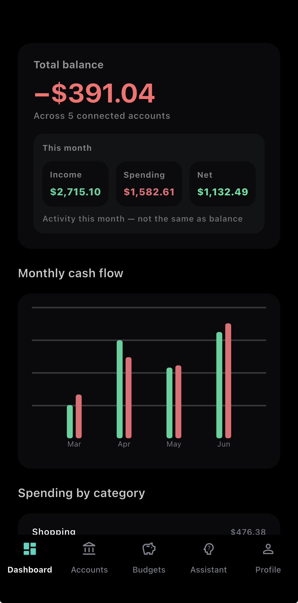
</p>

<p align="center">
  <strong>Real Plaid sync · Grok-powered Rex · Dark-first design</strong><br />
  <em>Personal finance that actually understands you.</em>
</p>

---

## The idea

Most finance apps show you numbers.

**Clarity lets you talk to them.**

Rex sees your real balances, transactions, and budgets — then remembers the personal context you choose to save. No context-switching between apps. One calm place for money, goals, memory, chat, and voice.

---

## App gallery

<p align="center">
  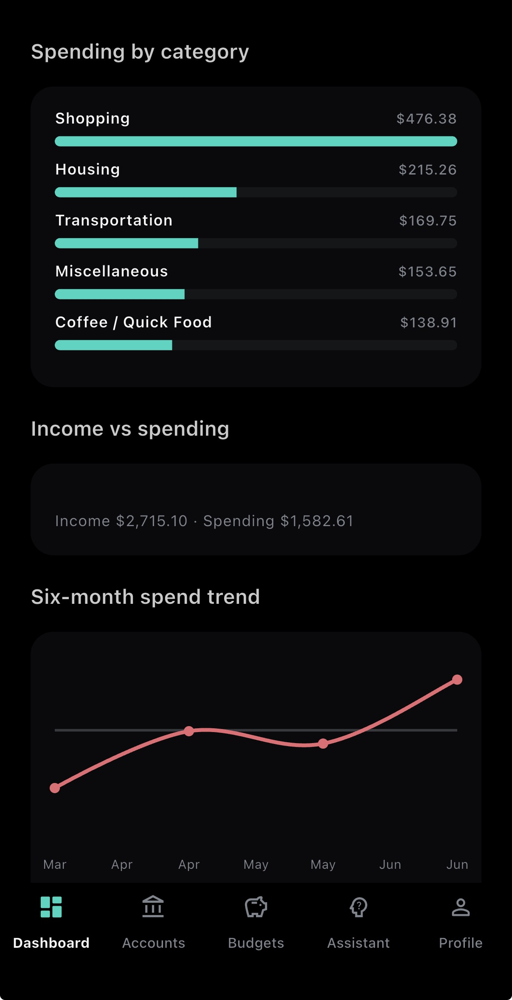
  &nbsp;&nbsp;
  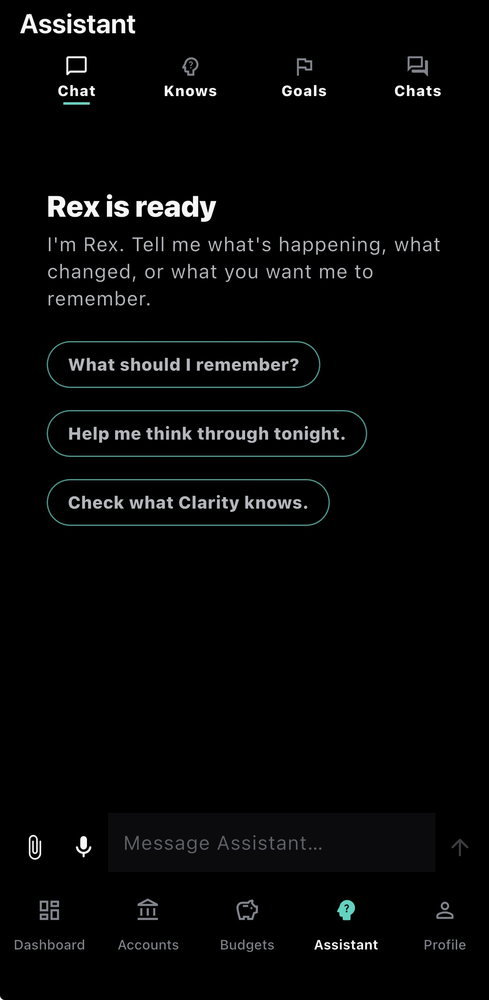
</p>

| | |
|---|---|
| **Dashboard** — See your complete financial picture at a glance | **Accounts** — Connect banks and stay synced with Plaid |
|  | 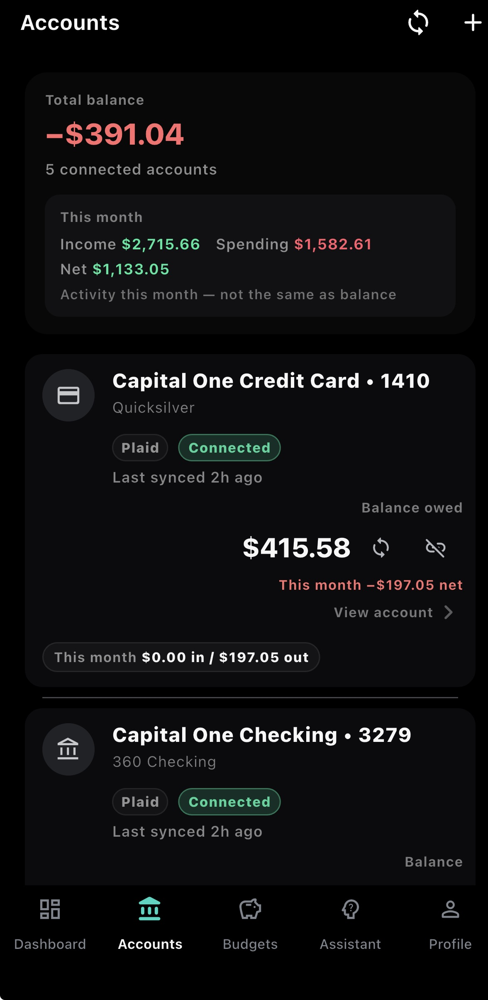 |
| **Budgets** — Set limits from real spending — monthly, weekly, or custom | **Transactions** — Find any purchase fast with search and filters |
| 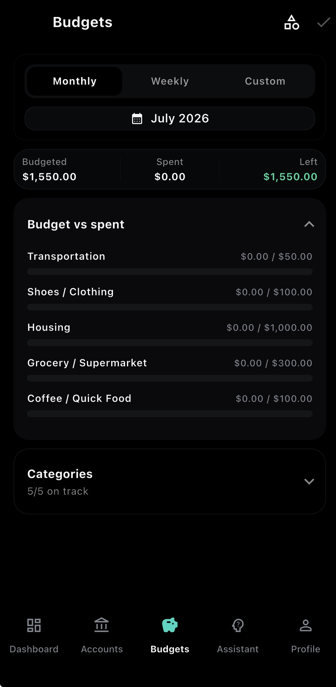 | 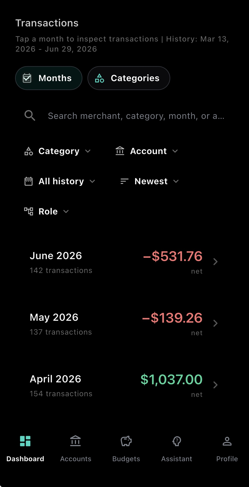 |
| **Rex Chat** — Talk naturally about money and life — Rex understands both | **Knows** — Your personal memory vault — editable and searchable |
|  | 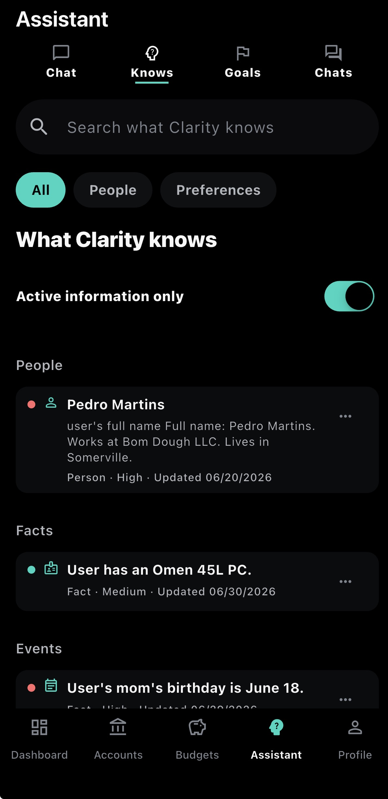 |
| **Goals** — Track what you're working toward — Rex keeps it in the conversation | **Voice** — Hands-free Rex when typing isn't an option |
| 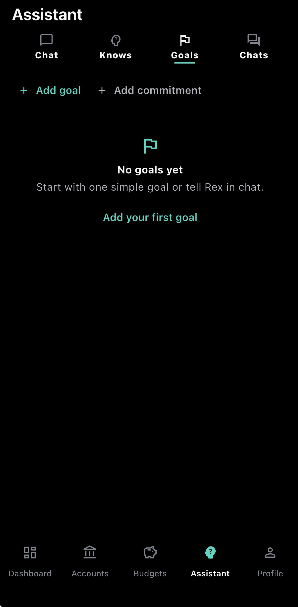 | 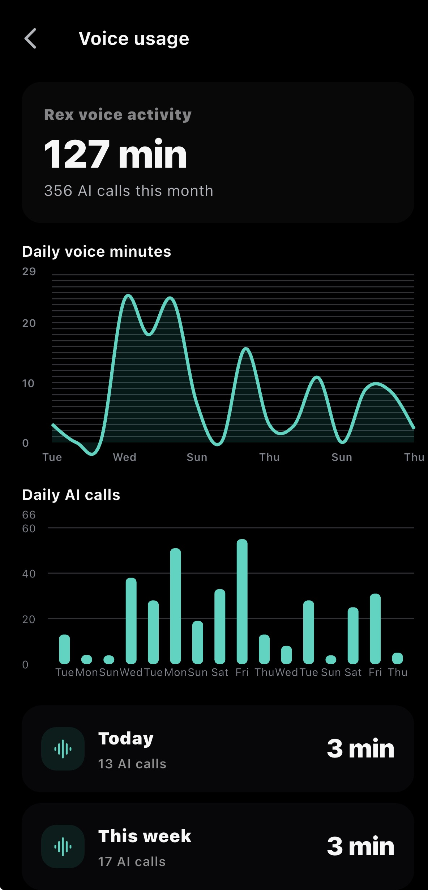 |

<p align="center">
  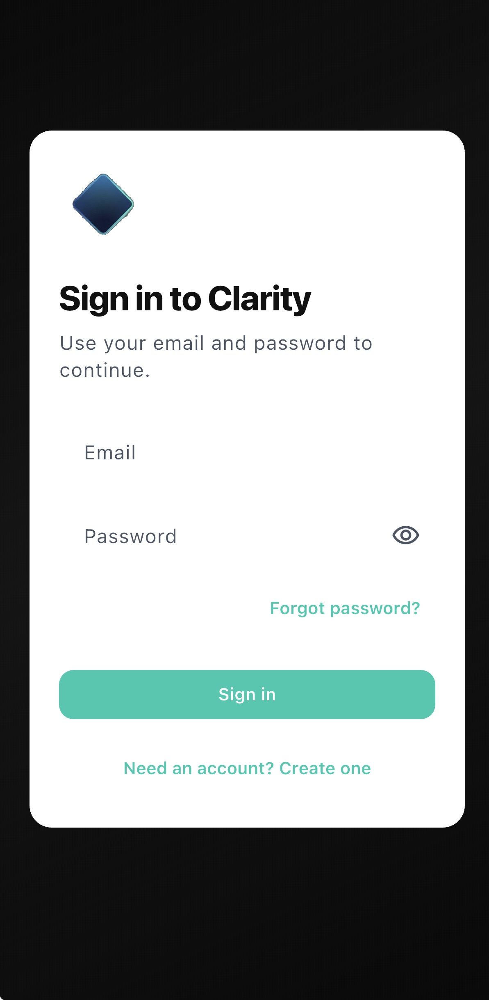
  &nbsp;
  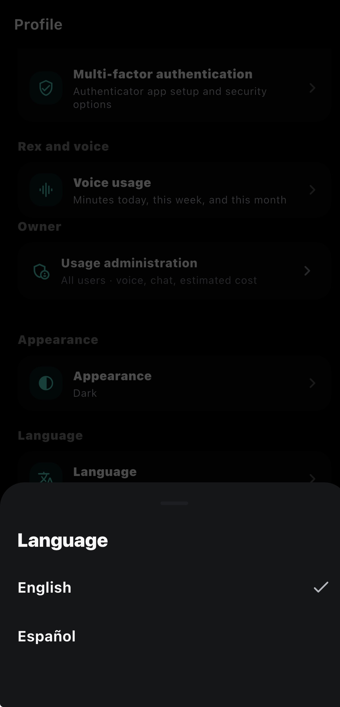
  &nbsp;
  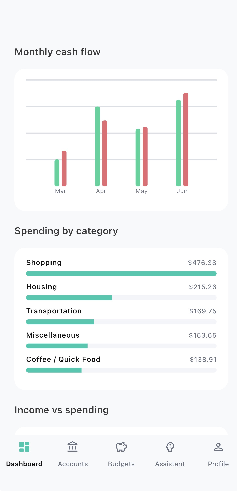
</p>
<p align="center"><sub>Sign in · Language &amp; appearance · Light mode</sub></p>

---

## What Clarity does

**Connect accounts** via Plaid — dashboard, budgets, and transactions stay in sync. **Import CSV** when you need a fallback. **Edit budgets** from real category history with inline amounts and comfortable mobile scrolling.

### Rex — your personal AI assistant

- Chat with full context of your finances and saved life details
- Voice mode for hands-free conversations
- **Knows** — secure, editable memory (People, Events, Preferences, Facts) you control
- **Goals & Open Threads** — track goals and opt-in companion follow-ups with Rex

Rex only saves what you explicitly confirm. Every durable action is backend-verified — no fake memory, no invented balances.

---

## Why this build stands out

| Signal | Detail |
|--------|--------|
| **Real integrations** | Live Plaid bank sync + Grok AI + Supabase — production grade, not prototypes |
| **Memory you control** | Rex only saves what you explicitly confirm. No hidden or fake memory. |
| **Trust-first design** | Every action (save, budget change, recall) is backend-confirmed |
| **Polish & usability** | Dark-first UI, English + Spanish, smooth voice mode, comfortable mobile experience |
| **Shipped & real** | Full flows on device: Dashboard, Plaid sync, Rex chat + memory, Goals, Voice |

---

## Tech stack

| Layer | Technology |
|-------|------------|
| Mobile | Flutter · Riverpod |
| Backend | Python FastAPI |
| Database & auth | Supabase (Postgres, Auth, Edge Functions) |
| Bank data | Plaid |
| Rex AI | Grok via Rex API — chat, voice, memory, recall |

---

## Status

Active MVP — core flows running on device.

| Area | Status |
|------|--------|
| Dashboard, accounts, transactions | ✅ Plaid + CSV |
| Budgets | ✅ Live |
| Rex chat, Knows, Goals | ✅ Live |
| Voice | ✅ Live |
| Localization | ✅ EN + ES |

---

<details>
<summary><strong>Local development setup</strong></summary>

### Prerequisites

- Flutter SDK `^3.11.4` · Xcode and/or Android Studio
- Supabase CLI (optional) · Rex API (`services/rex-api`)

### Quick start

```bash
cd apps/mobile
flutter pub get
cp .env.example .env   # SUPABASE_URL, SUPABASE_ANON_KEY, REX_BACKEND_URL
flutter run
```

Backend: `uvicorn app.main:app --reload --port 8000` from `services/rex-api`  
Migrations: `supabase db push` from repo root

Full mobile setup: [`apps/mobile/README.md`](apps/mobile/README.md)

</details>

<details>
<summary><strong>Repository layout &amp; documentation</strong></summary>

| Path | What it is |
|------|------------|
| [`apps/mobile/`](apps/mobile/) | Flutter app |
| [`services/rex-api/`](services/rex-api/) | Python FastAPI — assistant backend (memory, chat, voice, Plaid) |
| [`supabase/`](supabase/) | Migrations, Edge Functions, auth |
| [`docs/`](docs/) | Canonical project documentation (3 files) |

- [`docs/MASTER_PLAN.md`](docs/MASTER_PLAN.md) — product vision
- [`docs/CLARITY_RULES.md`](docs/CLARITY_RULES.md) — behavioral rules (assistant, memory, trust)
- [`docs/PROJECT_STRUCTURE.md`](docs/PROJECT_STRUCTURE.md) — code layout and production wiring

</details>

---

## License

Private / unpublished. All rights reserved.
