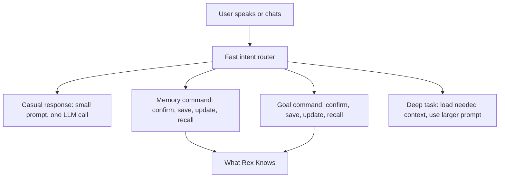

# New Rex Simplified Architecture

Status: Superseded by the Clarity subsystem plan set in `docs/clarity/product/CLARITY_PREBUILD_FOUNDATION_MASTER_PLAN.md`.

This file is retained as historical Rex simplification context only. Rex is now
treated as the Assistant personality inside Clarity, not as a standalone product
architecture plan.

## Executive Summary

This document replaces `docs/FULL_PROJECT_11_10_POLISH_MASTER_PLAN.md` as the official Rex architecture plan.

Rex is being rebuilt around one aggressive goal: make the normal voice/chat turn fast, cheap, and understandable. The old architecture loads too much context, carries too much prompt text, runs a second memory-extraction LLM call, and still creates pending memory cards after Rex already sounded like he understood the user. That ends here.

The new architecture is voice-first and direct:

- Rex should answer casual messages with one small prompt and one LLM call.
- Rex should not run a second heavy memory LLM call on normal turns.
- Rex's default system prompt must stay under 1200 characters.
- When Rex naturally confirms a fact in voice or chat, Rex saves it directly.
- When the user corrects saved information, Rex updates or replaces the old memory.
- Pending memory candidates, cards, review sessions, approval queues, and MemoryCandidate concepts are removed from the product.

Short-term memory is recent chat history, usually the last 10-20 messages. Long-term memory is durable user information in the database: birthdays, preferences, address, job, important dates, family details, financial facts the user explicitly wants Rex to remember, and similar personal context.

This plan skips another mapping phase. We already understand the old system well enough: pending memory candidates, oversized prompts, eager context loading, and post-turn extraction are the drag. The work starts directly with implementation. First we make natural memory saving reliable. Then we kill the second LLM call. Then we shrink the prompt. Only after those high-impact changes do we delete the old pending-candidate backend and polish the UI.

## Non-Negotiable Rules

- Voice is the primary interface.
- The default Rex system prompt must stay under 1200 characters.
- No second memory-extraction LLM call on normal turns.
- No pending memory candidates, pending cards, approval queues, or review sessions.
- Natural confirmation in chat or voice saves directly to long-term memory.
- Corrections update or replace existing memory instead of creating duplicates.
- The Memory tab becomes an editable "What Rex Knows" style view.
- Complex reasoning and heavy context loading happen only when the turn actually needs them.

## Phase 1: Replace Memory Saving With Direct Natural Flow

**Status:** Completed.

### Goal

Completely replace the old memory confirmation system with a simple, direct natural flow. When the user states a simple fact, Rex should acknowledge it naturally in the same response and save it directly to long-term memory. No pending candidates. No extra confirmation step. No new pending records.

### Files To Change

- `services/rex-api/app/services/memory_intent_service.py`
- `services/rex-api/app/services/memory_turn_service.py`
- `services/rex-api/app/services/chat_service.py`
- `services/rex-api/tests/test_memory_command_service.py`
- `services/rex-api/tests/test_chat_simple_memory_flow.py`

### What Done Looks Like

- Rex saves low-risk personal facts automatically when the user plainly states them.
- Rex acknowledges saved facts naturally: "Got it, your mom's birthday is June 18."
- Rex does not ask "Should I remember that?" for obvious low-risk facts such as name, city, birthday, job, preference, or family detail.
- Rex asks for confirmation only for sensitive or action-like information: goals, financial commitments, reminders, account/security details, and corrections that overwrite existing memory.
- Corrections update the existing memory instead of creating a duplicate.
- Normal conversation cannot create pending memory candidates.
- This phase stays focused on the existing memory path; do not add a new service layer unless a file would otherwise exceed the architecture size limits.

### Acceptance Criteria

- "My name is Pedro" saves directly without asking for confirmation.
- "I live in Somerville" saves directly without asking for confirmation.
- "My mom's birthday is June 18" saves directly and Rex acknowledges it naturally.
- "Do you remember my mom's birthday?" recalls June 18 on the next turn.
- "No, it is June 28" asks for confirmation before overwriting the existing birthday memory.
- "Remind me to send $200 on the 10th" asks for confirmation because it is a commitment/action.
- "Forget that" or "Do not save that" prevents or removes the relevant memory.
- Tests prove no pending candidate is created from normal conversation.
- `rg "memory_candidate|MemoryCandidate|memory-candidates" services/rex-api/app/services/chat_service.py services/rex-api/app/services/memory_turn_service.py services/rex-api/app/services/memory_intent_service.py` shows no normal-turn creation path.

## Phase 2: Eliminate The Second LLM Call On Normal Turns

**Status:** Completed.

### Goal

Stop running heavy post-turn memory extraction after normal chat and voice turns. This is the highest-impact latency and cost reduction. The old extractor files should be removed from active code, not kept as alternate paths.

### Files To Change

- `services/rex-api/app/services/chat_service.py`
- `services/rex-api/tests/test_chat_service.py`
- `services/rex-api/tests/test_chat_simple_memory_flow.py`
- `services/rex-api/tests/test_memory_reliability_flow.py`

Delete:

- `services/rex-api/app/services/memory_post_turn_service.py`
- `services/rex-api/app/services/memory_extraction_service.py`
- `services/rex-api/app/services/memory_extraction_prompt.py`
- Legacy extraction/post-turn tests tied to those files

### What Done Looks Like

- Casual turns use one LLM call only.
- Voice turns stream the answer without waiting for memory extraction.
- The 9000+ character memory extraction prompt is removed from active code.
- No memory extraction service exists as an alternate normal-turn path.
- Memory saving uses Phase 1 direct commands instead.

### Acceptance Criteria

- "How are you?" produces one Grok call.
- "Tell me a joke" produces one Grok call.
- "Thanks" produces one Grok call.
- "Remember my mom's birthday is June 18" uses the direct memory path, not post-turn extraction.
- No post-turn extraction runs for casual messages.
- Tests assert chat and voice normal turns use only the main response LLM call.

## Phase 3: Shrink The Default Rex Prompt Under 1200 Characters

**Status:** Completed.

### Goal

Replace the large always-on prompt with a compact voice-first prompt. The default prompt must be short enough for fast voice turns.

### Files To Change

- `services/rex-api/app/services/prompt_constants.py`
- `services/rex-api/app/services/prompt_service.py`
- `services/rex-api/app/services/rex_brain_prompts.py`
- `services/rex-api/tests/test_prompt_service.py`

### What Done Looks Like

- Default Rex prompt is warm, direct, accurate, and under 1200 characters.
- Voice uses the same small prompt or an even smaller variant.
- Memory safety instructions load only when the turn is a memory command.
- Goal/action safety instructions load only when the turn is a goal/action command.
- Deep reasoning instructions load only for deep tasks.

### Acceptance Criteria

- Default system prompt length is <= 1200 characters.
- Voice prompt length is <= 1200 characters.
- Casual chat does not include full memory discipline policy.
- Casual chat does not include long action-truth policy text.
- Tests assert prompt size budgets.

## Phase 4: Build A Fast Intent Router

**Status:** Completed.

Phase 4 added a deterministic, no-LLM `RexIntentRouter` and wired it into
both regular chat and streaming/voice chat before context loading. Casual,
finance, direct memory-save, memory-update, memory-recall, goal/commitment,
deep-reasoning, and unknown turns now choose different context-loading paths.
The implementation intentionally keeps ambiguous planning requests in the
safer unknown path so useful preferences can still be recalled.

### Goal

Route each user message before loading expensive context or calling the LLM.

### Files To Change

- `services/rex-api/app/services/rex_intent_router.py`
- `services/rex-api/app/services/chat_service.py`
- `services/rex-api/app/services/chat_context_service.py`
- `services/rex-api/tests/test_rex_intent_router.py`

### What Done Looks Like

The router classifies messages into:

- casual
- memory_save
- memory_update
- memory_recall
- goal_or_commitment
- finance
- deep_reasoning
- unknown

### Acceptance Criteria

- [x] Casual messages do not load long-term memory unless needed.
- [x] Memory questions load memory context without goal context.
- [x] Explicit goal questions load goal/accountability context without generic
      long-term memory fetches.
- [x] Finance questions avoid memory/goal context unless financial context is
      supplied by the caller.
- [x] Deep reasoning is opt-in or clearly justified.
- [x] Intent routing itself does not call an LLM.

## Phase 5: Make Context Retrieval Lazy And Small

**Status:** Completed.

Phase 5 tightened the retrieval policy created in Phase 4 and added production
timing visibility. Pure goal/progress turns now load plans, milestones, and
commitments without generic long-term memory or structured memory fan-out.
Accountability/rule-risk turns still load structured memory because rules and
commitments are needed for accurate coaching. Every context fetch now logs
intent, loaded sources, returned counts, per-source timings, and total latency.

### Goal

Stop loading every context source on every turn.

### Files To Change

- `services/rex-api/app/services/chat_context_service.py`
- `services/rex-api/app/services/chat_turn_context.py`
- `services/rex-api/app/services/memory_retrieval_service.py`
- `services/rex-api/app/services/goal_context_service.py`
- `services/rex-api/tests/test_chat_context_service.py`

### What Done Looks Like

- Casual messages load recent chat only.
- Memory recall loads relevant long-term memory.
- Goal/accountability queries load plans and commitments.
- Finance queries load financial context.
- Structured memory fan-out is not default.
- Context retrieval logs show what was loaded and how long it took.

### Acceptance Criteria

- [x] A casual turn avoids structured memory table fan-out.
- [x] A memory recall turn retrieves relevant facts reliably.
- [x] A goal turn retrieves plans and commitments without generic memory fetches.
- [x] A finance turn avoids memory/goal context unless supplied by the caller.
- [x] Context fetch timings are visible in `rex.context` logs.

## Phase 6: Delete The Pending Candidate Backend

**Status:** Completed.

Phase 6 removed the pending-memory candidate backend surface entirely. The
backend no longer imports or exposes `MemoryCandidate`, `/memory-candidates`,
or `memory_candidate` services. Chat and voice no longer have a candidate
decision branch; accountability no longer reports pending memory candidates;
corrections now use a dedicated correction repository instead of the old
candidate repository. The database tables may be dropped in a later migration
after mobile no longer depends on the pending UI.

### Goal

Remove the old pending memory candidate backend completely after the direct memory path and one-call turn path are protected.

### Files To Change

Delete or replace:

- `services/rex-api/app/models/memory_candidate.py`
- `services/rex-api/app/routes/memory_candidates.py`
- `services/rex-api/app/services/memory_candidate_service.py`
- `services/rex-api/app/services/memory_candidate_writer.py`
- `services/rex-api/app/services/memory_candidate_decision_service.py`
- `services/rex-api/app/services/memory_candidate_decision_formatter.py`
- `services/rex-api/app/services/memory_candidate_review_*`
- `services/rex-api/tests/test_memory_candidate_*`

Update:

- `services/rex-api/app/main.py`
- `services/rex-api/app/dependencies.py`
- `services/rex-api/app/services/chat_service.py`

### What Done Looks Like

- No backend route exposes pending memory candidates.
- No backend service imports MemoryCandidate.
- Chat and voice still work.
- Long-term memory save, update, list, and recall still work.

### Acceptance Criteria

- [x] `rg "MemoryCandidate|memory_candidate|memory-candidates" services/rex-api/app`
      returns no active implementation references.
- [x] Backend tests pass.
- [x] `/ready` route still compiles as part of the backend app.
- [x] Chat does not create pending memory records.

## Phase 7: Rename And Simplify The Memory UI

**Status:** Completed.

Phase 7 renamed the user-facing Assistant Memory tab to "Knows" and made the
page a saved-information-only surface titled "What Rex Knows." The mobile app
no longer calls `/memory-candidates`, renders pending/correction tabs, or shows
candidate cards in chat. The old candidate mobile API, pending review widgets,
and chat candidate card widgets were deleted.

### Goal

Replace the Memory tab with a clean, editable "What Rex Knows" or "My Information" view.

### Files To Change

- `apps/mobile/lib/features/assistant/memory/presentation/pages/memory_page.dart`
- `apps/mobile/lib/features/assistant/memory/application/memory_controller.dart`
- `apps/mobile/lib/features/assistant/memory/data/memory_api.dart`
- `apps/mobile/lib/features/assistant/presentation/assistant_screen.dart`
- Mobile tests for memory page and assistant navigation

### What Done Looks Like

- [x] No Pending tab.
- [x] No Corrections tab.
- [x] No pending cards.
- [x] Saved information is grouped clearly: identity, people, places, preferences, dates, work, finance, goals.
- [x] User can edit or delete saved facts.

### Acceptance Criteria

- [x] UI label is "What Rex Knows" or "My Information."
- [x] Users can update a saved fact from the app.
- [x] Users can delete a saved fact from the app.
- [x] No pending candidate API is called from mobile.

## Phase 8: Simplify Goals And Commitments

**Status:** Completed.

### Goal

Make goals and commitments explicit commands instead of side effects from memory extraction.

### Files To Change

- `services/rex-api/app/services/goal_command_service.py`
- `services/rex-api/app/services/plan_service.py`
- `services/rex-api/app/services/commitment_service.py`
- `services/rex-api/app/services/accountability_service.py`
- `services/rex-api/tests/test_chat_service.py`

### What Done Looks Like

- [x] "Track this as a goal" saves or updates a plan directly.
- [x] "Remind me to send $200 on the 10th" saves a commitment directly.
- [x] Duplicate goals update or reuse existing records.
- [x] Accountability reads saved goals and commitments but does not create hidden pending work.

### Acceptance Criteria

- [x] A goal can be created from chat or voice.
- [x] A commitment can be created from chat or voice.
- [x] A duplicate goal updates or reuses the existing goal.
- [x] Goal/accountability recall works without pending candidates.

## Phase 9: Final Cleanup, Migration, And Manual Validation

**Status:** Technical cleanup completed; production migration and manual device
validation remain as the final release checks.

Phase 9 added a defensive archive-and-drop migration for the old memory review
tables and completed the active-code cleanup. Product code no longer imports,
routes to, renders, or references the old pending memory review system. The
remaining work is operational: push the Supabase migration, restart the backend,
run a release build on device, and complete the manual validation checklist.

### Goal

Remove dead code, migrate or archive old pending data, and validate the simplified system end to end.

### Files To Change

- Supabase migrations for old pending candidate tables
- `docs/REX_SERVICES_ARCHITECTURE.md`
- `docs/deployment.md`
- Backend and mobile tests
- Release scripts if needed

### What Done Looks Like

- [x] Old memory review tables have an archive-and-drop migration.
- [x] Dead backend and mobile files are deleted.
- [x] Docs describe the new architecture only.
- [ ] Supabase migration is applied to production after data safety review.
- [ ] Manual testing is completed on a physical device.

### Acceptance Criteria

- [x] `rg "pending candidate|MemoryCandidate|memory-candidates|review session"` finds no active product code.
- [x] Backend tests pass.
- [x] Flutter tests pass.
- Manual voice test passes:
  - User tells Rex a birthday.
  - Rex confirms naturally.
  - User says yes.
  - Rex saves directly.
  - User asks later.
  - Rex recalls it correctly.
- Manual correction test passes:
  - User corrects a saved fact.
  - Rex updates the old record.
  - No duplicate is created.

## Target End State

Rex should feel simple:

The product should no longer feel like an admin system. It should feel like Rex knows what the user told him, remembers confirmed facts, corrects himself cleanly, and stays fast in everyday conversation.
