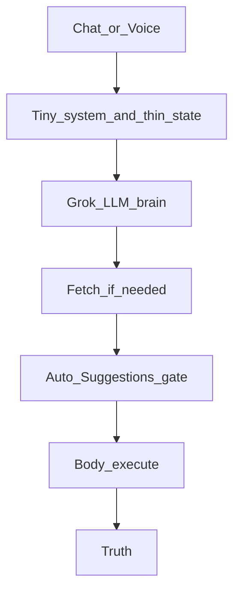

# PROJECT_STRUCTURE.md

**Canon:** technical architecture, engineering standards, and development rules.

Product vision: [`MASTER_PLAN.md`](MASTER_PLAN.md). Behavioral rules: [`CLARITY_RULES.md`](CLARITY_RULES.md).

## 0. Engineering Standards — Shipping Phase (Highest Priority)

We are in the Shipping Phase. Code quality, simplicity, and long-term maintainability take absolute priority over speed.

**Always:**

- Solve the root cause of problems, never apply temporary patches
- Implement general, scalable solutions that work for all users
- Keep files under 400 lines (extract before adding new code)
- Follow the existing architecture and module boundaries strictly
- Use current best practices and modern patterns appropriate for the tech stack

**Never:**

- Add artificial timeouts or fallback timers to fix race conditions (especially in voice)
- Add hardcoded triggers, examples, or special cases based on one user's data
- Create patches, workarounds, or "quick fixes"
- Mix concerns between `features/` and `rex/` directories
- Grow any file beyond 500 lines

**When fixing bugs:**

- First identify the generic class of the problem
- Then implement a proper, reusable solution for that class
- Never add code that only works for one specific situation

## 1. Tech Stack

| Layer | Technology |
| --- | --- |
| Mobile | Flutter / Dart · Riverpod |
| Backend | Python / FastAPI (`services/rex-api`) |
| Database & Auth | Supabase / Postgres |
| Bank connections | Plaid (CSV import fallback) |
| Assistant LLM | Grok via backend |
| Voice | Mobile capture + backend STT/TTS (Deepgram, Google TTS) |

## 2. Repository Layout

```text
apps/mobile/          Flutter app
  lib/app/            Bootstrap, routing shell
  lib/core/           Supabase/config, shared models, Rex API client
  lib/features/       Financial features (dashboard, accounts, budgets, transactions, profile)
  lib/rex/            Assistant (chat, voice, memory, goals)
  lib/theme/          Design tokens and Material themes
  lib/widgets/        Reusable UI components

services/rex-api/     FastAPI backend — chat, voice, memory, Plaid sync, prompts
supabase/             Migrations, Edge Functions, auth templates
plans/                Execution plans only (01→05) — not product/engineering law
```

**Separation rule:**
- All financial features live under `apps/mobile/lib/features/`.
- All assistant code lives under `apps/mobile/lib/rex/`.
- They share data models from `apps/mobile/lib/core/`.
- Do not mix assistant code inside features or financial code inside `rex/`.

### Execution plans (`plans/`)

The **only** execution track for the assistant brain redesign is `plans/01`–`plans/05` (see `plans/README.md`). Order is strict: 01 → 02 → 03 → 04 → 05. Do not add competing plan docs under `docs/`. Product and engineering law remain the three hearts in `docs/` only.

## 3. Feature-First Module Pattern

```text
feature/
  domain/          models, policies, business rules
  application/     workflows, controllers, use cases
  data/            repositories, API clients, mappers
  presentation/    screens, widgets, view models
```

Presentation depends on application/domain, never the reverse.

## 4. File Size and Split Policy

**STOP before editing any file over 400 lines.** Extract first, patch second.

| Scope | Target | Stop | Never exceed |
| --- | --- | --- | --- |
| All code | 150–300 lines | 400 lines | **500 lines** |
| Assistant context / recall / prompt modules | 150–250 lines | **400 lines** | **500 lines** |

**Before you edit:**
1. Check line count of the target file.
2. If **over 500**: do not add features — split the file first.
3. If **400–500**: extract new logic into a focused module; only tiny fixes in the oversized file.
4. If **under 400**: normal edits; stop before hitting 400.

**Split recipe:**
- One thin orchestrator (e.g. `handle_turn`, route handler) — ~80–120 lines.
- Focused modules by responsibility — parsing, queries, writes, formatting.
- Move tests with extracted code; keep public behavior unchanged.

**Known violators and watch list** — re-audit when touched:

| File | Lines (approx.) | Notes |
| --- | ---: | --- |
| `plan_intelligence_service.py` | 471 | watch — split before adding features |
| `memory_intent_facts.py` | 461 | watch |
| `plaid_sync_service.py` | 455 | watch |
| `memory_turn_service.py` | 455 | watch |
| `chat_turn_orchestrator.py` | 454 | split complete — do not re-grow |
| `plan_merge_service.py` | 448 | watch |
| `memory_retrieval_ranker.py` | 444 | watch |
| `memory_intent_service.py` | 443 | watch |

**Recently split (under 500 — keep them there):**

| Area | Modules |
| --- | --- |
| Backend usage tracking | `usage_tracking_service.py` (orchestrator), `usage_tracking_transport.py`, `usage_tracking_owner_queries.py` |
| Backend assistant turn | `chat_turn_orchestrator.py`, `chat_turn_orchestrator_support.py` (short-circuit understanding layer is kill-listed — see `plans/02`) |
| Backend recall | `chat_recall_search.py`, `chat_recall_search_runners.py`, `recall_intent_helper.py`, `recall_intent_detection.py`, `recall_intent_query.py` |
| Backend memory corrections | `memory_correction_service.py`, `memory_correction_apply.py` |
| Mobile chat | `chat_controller.dart`, `chat_controller_send.dart`, `chat_controller_actions.dart`, `chat_controller_context.dart` |
| Mobile voice | `voice_call_controller.dart` + `voice_call_controller_streaming*.dart` parts |
| Mobile finance context | `assistant_financial_context_service.dart`, `assistant_financial_context_intent.dart`, `assistant_financial_context_builder.dart` |

`chat_context_service.py` was split and is under the limit — do not re-grow it. Same limits apply under `apps/mobile/lib/`.

## 5. Coding Conventions

- Use clear, specific domain names. Avoid vague names like `utils`, `helper`, `manager`.
- Keep business logic out of UI widgets.
- Add tests for important logic and workflows.
- Do not silently swallow user-critical errors.
- Plaid tokens must remain backend-owned.
- All user data must be properly scoped to the authenticated user.

## 6. Assistant Production Path (target)

One production pipeline for chat and voice. **Grok is the LLM brain** every turn. The backend is the **body** — it executes capabilities, applies confirm gates, and enforces Truth. Spoken replies use **Google TTS** (not Grok speech). No long persona prompt. No reply-length setting.

```text
Chat/Voice → ChatService → Orchestrator
  → tiny system (Truth + Off/Text/Card + capability NAMES)
  → thin state (recent turns + open thread titles if any)
  → Grok (LLM brain) → structured action(s) | just_chat | unsupported
  → fetch capability if needed (finance / person / recall)
  → Auto Suggestions gate → body execute → Truth → reply
  → Voice: Google TTS speaks the reply
```



### Token / prompt rules

| Piece | Guide |
| --- | --- |
| Capability **names** only | Short identifiers — not manuals |
| Truth + Off/Text/Card + kind flags | Small fixed rules |
| Recent chat + open thread **titles** (≤5) | Thin state |
| **Base total** | Aim **&lt; ~1k** input tokens |
| Fetch / tool packs | Extra only when the situation needs them |

Do **not** always-on dump full Knows or full finance into every base turn.

### Brain vs body

| Role | Keep (body / policy / transport) |
| --- | --- |
| Entry | `chat_service.py`, chat/voice routes |
| Durable writes | `durable_write_*.py` (incl. milestone kinds) |
| Open thread **storage** | `open_thread_service.py`, repository, `/open-threads` |
| Finance body | `ClarityControlService`, `/clarity/actions`, action parser as executor |
| Proposal settings | Off/Text/Card + kinds + finance edits (not reply length) |
| Truth | `chat_response_truth.py`, `action_truth_policy.py` |
| Recall engine | `chat_recall_service.py`, search ranking/repo |
| Prompt assembly | `prompt_service.py` (rewired for names + thin state + fetch packs) |
| Grok I/O | AI generate/stream |

| Forbidden as understanding (kill list — `plans/02`) | Examples |
| --- | --- |
| Heuristic intent / classify authority | `rex_intent_router.py`, `rex_intent_*.py` as turn authority |
| Pre-Grok short-circuit understanding | `chat_turn_orchestrator_short_circuit.py` understanding branches |
| Open-thread offer/overlap detectors | `open_thread_eligibility.py`, `open_thread_overlap.py` as understanding |
| Memory / goal / plan phrase brains | `memory_turn_*`, `memory_intent_*`, `goal_command_service.py`, `conversational_plan_*` short-circuit paths |
| Reply-length reshaping | `prompt_response_style.py`, `assistant_response_style.py`, Profile Reply length UI |

**Transitional note:** until plans 04–05 land, some kill-listed modules may still exist in the tree. Do not extend them. Prefer deletion (04) and simple Grok + body handlers (05) over shims.

**Key mobile files:**

| Role | File |
| --- | --- |
| Chat | `apps/mobile/lib/rex/chat/application/chat_controller*.dart` |
| Voice | `apps/mobile/lib/rex/voice/application/voice_call_controller*.dart` |
| Finance context (assistant) | `apps/mobile/lib/features/finance/application/assistant_financial_context_*.dart` |
| Knows | `apps/mobile/lib/rex/memory/application/memory_controller.dart` |
| HTTP client | `apps/mobile/lib/core/rex/rex_api_client.dart` |
| Confirm cards | `apps/mobile/lib/rex/chat/presentation/widgets/clarity_action_cards_strip.dart` (voice uses same `write_proposals`) |
| Companion settings | Auto Suggestions Off/Text/Card + kinds + finance edits — **no** reply-length control |

## 7. Memory and Recall Wiring

### Write-path invariants

1. One production pipeline for chat and voice: Grok as LLM brain + body capability handlers (`ChatService` / orchestrator entry).
2. Durable writes: `DurableWriteProposal` → pending action → confirm card → frozen `apply_snapshot`.
3. Mobile receives `write_proposals` only (no hidden discipline metadata).
4. After confirm, item is visible in Knows or Goals without manual refresh.
5. Open Threads require explicit consent — no silent create.
6. Relationship edges and shared-history (social) events require explicit user confirmation in chat **and** voice — same `write_proposals` path; no chat-only social saves.
7. Social-neighborhood prompt injection ships only after Knows UI can show Connections and Shared history (Phase 03 before Phase 02).
8. No ops script or silent job may create `entity_relationships` or shared-history links without user confirmation. Do not auto-bridge people from old conversations.

**Requires confirm card (chat/voice):** flat memory, person/entity cards, relationships/connections (`relationship`), social/shared events (`social_event`), plans/goals, entity events, deletes.

**Manual UI:** Knows / Goals REST CRUD — user fills form and taps Save (including Connections and Shared history when those surfaces exist).

**Mobile confirm flow:** `write_proposals` → `ClarityActionCardsStrip` (and voice confirm UX on the same proposals) → `write_confirmation` → refresh `memoryProvider` + `accountabilityProvider` (and relationship/shared-history providers when added).

### Write lifecycle

```text
UserIntent → MemoryDisciplineService.decide() (where wired)
          → BackendConfirmedWrite (create/update via service or repository)
          → Optional person materialization (save path only, not read path)
          → memory_changes / Knows refresh
```

- `MemoryDisciplineService` runs before structured creates and flat creates (`POST /memory`, chat saves), and before creating or updating **entity relationships** and **shared-history / social events** (including participant sets).
- Duplicate detection merges or updates existing records instead of silently creating duplicates.
- Duplicate active relationship edges for the same `(from_entity_id, to_entity_id, predicate)` must merge/update — never silently create a second active edge.
- UI success is allowed only after the backend returns a confirmed record id.
- Person materialization runs after confirmed person-category flat saves — **not** on Knows read/list paths.

### Relationship web (target wiring)

People Cards remain `entities` (nodes). Connections and Shared history extend Saved Memory:

| Object | Storage |
| --- | --- |
| Person / node | `entities` (`entity_type = person`), including self node (`relationship = self`) |
| Connection / edge | `entity_relationships` (`from_entity_id`, `to_entity_id`, `predicate`, status, …) |
| Shared history | `entity_events` + `entity_event_participants` (multi-person membership) |

Canonical tables/services (land with social-intelligence phases; keep modules under file-size limits):

| Role | Backend | Mobile |
| --- | --- | --- |
| Relationship edges | `entity_relationship_service.py`, `entity_relationship_repository.py`, `/entity-relationships` | relationship models/API, Knows Connections UI, relationship confirm card |
| Event participants | `entity_event_participant_service.py` (or equivalent), `entity_event_participants` | Shared history on person detail |
| Self node | `self_entity_service.py` | via person card `relationship = self` |
| Social write propose/apply | `social_relation_intent.py`, `social_event_intent.py`, `social_relationship_proposal.py`, durable-write social apply | same `write_proposals` in chat and voice |
| Social neighborhood (read) | `social_neighborhood_service.py` | N/A (backend prompt) |
| Social prompt section | `prompt_social_neighborhood_context.py` | N/A |
| Predicate vocabulary | `relationship_predicates.py` | confirm-card predicate labels |

**Ship order (Truth Rule):** Knows Connections + Shared history visibility (and confirm cards) before enabling social-neighborhood sections in prompts.

### Production paths

| Area | Backend | Mobile |
| --- | --- | --- |
| Chat turn | `ChatService`, orchestrator → Grok + body handlers | `ChatController`, `ChatApi` |
| Voice turn | same entry path; Google TTS for speech out | `VoiceCallController*`, same `write_proposals` confirm |
| Saved flat memory | `/memory`, `long_term_memory_repository.py`, `memory_write_service.py` | `MemoryApi`, `MemoryPage` |
| Structured memory | `/entities`, `/rules`, `/plans` | `memory_structured_api.dart`, Knows tiles |
| Person/entity cards | `entity_service.py` | person memory models, saved memory group list |
| Connections | `entity_relationships`, `entity_relationship_service.py`, `/entity-relationships` | Knows Connections, relationship confirm cards |
| Shared history | `entity_events` + `entity_event_participants` | Knows Shared history, social-event confirm cards |
| Social neighborhood | `social_neighborhood_service.py`, `prompt_social_neighborhood_context.py` | N/A (must only use Knows-visible facts) |
| Goals | `/plans`, `/accountability/overview` | `AccountabilityPage`, Goals section |
| Open Threads | `open_thread_service.py`, `/open-threads` | Goals tab Open Threads section |
| Old chat search | `conversation_repository.py`, `chat_search_*`, `chat_recall_*` | Chats tab search, recall context |
| Saved-knowledge overview | `SavedKnowledgeOverviewService`, `/saved-knowledge/overview` | Knows tab — must include People, Connections, and Shared history (not people-only) |
| Prompt labels | `prompt_memory_context.py`, `prompt_open_threads_context.py`, `prompt_structured_context.py`, `prompt_social_neighborhood_context.py` | N/A (backend-owned) |
| Truth enforcement | `chat_response_truth.py`, `action_truth_policy.py` | Chat/voice UI displays backend response state |

### Recall modules

| Role | File |
| --- | --- |
| Chat search fetch (body) | `chat_recall_service.py` |
| Chat search ranking | `chat_search_ranking.py` |
| User-scoped storage | `conversation_repository.py` |
| Social neighborhood | `social_neighborhood_service.py` |

Target trigger: Grok requests `search_chats` (or equivalent) — not a competing heuristic recall brain. Prompt modules label old chat hits as `Chat history, not saved memory`. Social neighborhood is labeled as saved knowledge (Connections / Shared history), never as chat history. `action_truth_policy.py` handles degraded, filtered, partial, and empty recall fallbacks — and must not treat unconfirmed or Knows-invisible social facts as remembered.

### Knows manual create

- Flat fact/preference via `POST /memory`
- Person, rule, plan via structured create routes
- Connections via `/entity-relationships` (or Knows UI) after user action
- Shared history via entity events + participants (or Knows UI) after user action
- Open Threads are **not** created through Knows — use `/open-threads` or consent flow in Goals context

### Duplicate suppression

When a flat long-term memory is fully covered by a structured person card, **delete** the duplicate flat memory — do not archive it as a soft hide.

When a relationship edge fully covers a prior flat “X is my Y” fact, prefer the Connection in Knows/prompt and **delete** duplicate active flats for the same link.

True duplicates of goals or related info follow the same rule: delete, do not archive.

### Memory corrections

`/memory/corrections` remains for diagnostics. Knows does not show a Corrections tab in MVP.

### Legacy

- **Commitments fully removed** (July 2026). The `commitments` table, routes, and assistant write paths are deleted. Companion continuity uses **Open Threads** only; plan-linked small steps use **milestones**.
- Early `memory_candidates` / `memory_confirmations` tables are **DB-archived only** (migration `20260604120456_archive_legacy_rex_memory_review_tables.sql`). No production code reads or writes them. Chat and voice saves use `DurableWriteProposal` → confirm cards → `DurableWriteApplier` with `MemoryDisciplineService` on the write path.
- Disabled bypass paths: `GoalCommandReclassifier` direct memory→goal writes, separate `save_plan` pending, auto merge unless `merge_disclosed_to` is set, auto person materialization on generic LTM REST create.
- **No automatic relationship-edge backfill** from `entities.relationship` text, chat history, or heuristic co-mentions. Existing person cards remain valid nodes; Connections are created only through explicit user confirmation or manual Knows save.

### Ops scripts

Run from `services/rex-api` after env is loaded:

| Script | Purpose |
| --- | --- |
| `scripts/backfill_structured_memory.py` | Batch promotion of flat memories into structured entities/plans/rules |
| `scripts/backfill_person_birthday_events.py` | Promote orphan birthday Event flats into person cards (dry-run default) |
| `scripts/apply_memory_corrections.py` | Classify/apply user corrections and dry-run duplicate audits |
| `scripts/cleanup_user_memory_duplicates.py` | Per-user Knows duplicate cleanup |

Do **not** add ops scripts that create `entity_relationships` or shared-history participant graphs without per-item user confirmation. Dry-run **reports** of possible links are allowed only if they never write edges.

`SupabaseMemoryService` in `memory_service.py` is the production Supabase facade for conversations and memory.

## 8. Open Threads Wiring

Goals tab overview returns `{ plans, open_threads }`.

**Body (keep):**
- `open_thread_service.py`, `open_thread_repository.py`
- `GET/PATCH/POST /open-threads` (user-scoped)
- Prompt: open thread **titles** only on the thin base turn (full detail via fetch/capability when needed)

**Target flow:** Grok proposes `create_open_thread` / update / delete → Auto Suggestions gate → body CRUD → Truth. No regex offer/overlap detectors as understanding (kill-listed in `plans/02`).

Open Threads are not included in `SavedKnowledgeOverviewService` / Knows.

## 9. Finance Wiring

### Canonical Supabase tables

| Data | Table |
| --- | --- |
| Profiles | `profiles` |
| Accounts | `accounts` |
| Plaid account metadata | `plaid_accounts` |
| Plaid item/token state | Backend-owned Plaid tables |
| Transactions | `transactions` |
| Categories | `categories` |
| Budgets | `budgets` |
| Merchant learning | `merchant_category_rules` |
| CSV import batches | `account_statement_imports` |
| Financial audit | `financial_audit_events` |

### Mobile read path

`apps/mobile/lib/features/finance/application/financial_read_model_service.dart` loads accounts, transactions, budgets, categories, merchant rules, and import batches.

Same read model powers Dashboard, Account detail, Budgets, Transaction review, and assistant financial context.

Supabase access: `apps/mobile/lib/core/supabase/supabase_repository.dart`.

### Mobile write path

Native finance UI writes directly to Supabase through feature services: `AccountService`, `TransactionService`, `CategoryService`, `BudgetService`, `MerchantCategoryRuleService`, `AccountStatementImportService`.

Writes must stay user-scoped through Supabase Auth and RLS. Validate before writing; show failure on reject; refresh read model after success; record audit events where supported.

### Assistant financial context

Target: finance insights and packs enter the prompt via **fetch capabilities** (`fetch_spend_insight`, `fetch_account_summary`, and similar) when needed — not as an always-on dump on every turn.

Catalog must match manual UI: categorize, category/budget CRUD, Plaid, CSV import. **No** `create_transaction` when users cannot create transactions outside Plaid/CSV.

Mobile may still build a summary for finance turns during the transition; do not expand always-on finance injection. Prompt formatter: `prompt_financial_context.py` (rewire toward fetch packs in plan 05).

### Assistant financial action writes

Confirmed actions route through `/clarity/actions` → `ClarityControlService` → Supabase. This is a second write path to the same finance tables — same validation, audit, refresh, and confirmation rules as native UI writes.

Complete only when: user confirms, backend returns applied result, mobile marks applied, mobile refreshes via `notifyDataChanged()`, assistant does not claim success before backend result exists.

### Plaid path

Backend-owned: mobile requests link tokens through backend → Plaid Link → public token → backend exchange → sync accounts/transactions → mobile reads Supabase records. Mobile reads Plaid item status from backend for recovery states. Plaid tokens and secrets must never be stored in mobile code.

### CSV path

Account-scoped CSV import from Accounts or account detail. Edge Function `categorize-transactions` for AI categorization. `UploadScreen` was removed.

## 10. Voice Wiring

Voice uses the same `ChatService` / `ChatTurnOrchestrator` path as chat.

**Production path:**

```text
Mobile inline voice panel
  → WebSocket `/voice/stream`
  → Deepgram streaming STT
  → ChatService / orchestrator → Grok + body
  → Google TTS
  → Mobile streaming audio playback
```

**Fallback** (streaming disabled or WebSocket unavailable):

```text
Mobile captured utterance
  → REST `/voice/turn`
  → Deepgram STT → ChatService → Google TTS → playback
```

**Runtime flags:**

| Flag | MVP default | Meaning |
| --- | --- | --- |
| `REX_CLOUD_VOICE_ENABLED` | `true` | Backend voice fallback |
| `REX_STREAMING_VOICE_ENABLED` | `true` | WebSocket streaming voice |
| `REX_EXPERIMENTAL_NATIVE_IOS_VOICE_ENABLED` | `false` | Native bridge experiments only |
| `REX_NATIVE_IOS_VOICE_ENABLED` | ignored | Legacy; do not use for release |

Native iOS voice bridge is experimental and must not become a second assistant pipeline.

**Usage tracking:** backend records STT/TTS/LLM turns and session duration. Profile voice usage reads `user_voice_summaries` from Supabase; backend also exposes `/usage/me`.

## 11. Product Routes (current)

- CSV import: account-scoped flow from Accounts or account detail (not standalone upload screen).
- Transaction review: production surface from Dashboard app bar (global and account-scoped).
- Knows, Goals (plans + Open Threads), Chats, Voice: under `apps/mobile/lib/rex/`.

## 12. Environments (light)

| Env | API | Secrets | Notes |
| --- | --- | --- | --- |
| Local | localhost rex-api | `services/rex-api/.env`, mobile `.env` | Dev |
| Prod VPS | `/opt/clarity/current` | `/opt/clarity/shared/rex-api.env` | Canonical prod; Auto Suggestions from **profile**, not an env override that wipes Off |

Staging / multi-region / auto-CD are out of scope until after the brain cutover (`plans/05`) unless already required for an emergency. Restart today via `scripts/vps_restart_rex_api.sh`.

## 13. CI

`.github/workflows/ci.yml` runs Flutter checks, pytest, and docs canon (`scripts/verify_docs_canon.sh`). Keep CI green for body/ops; expect plan 04 to go red on deleted brain modules until plan 05 restores the simple path. Auto-deploy CD is nice later — not required for cutover.

## 14. Where to Look First

| Question | Start here |
| --- | --- |
| What is Clarity? | `docs/MASTER_PLAN.md` |
| What must the assistant do? | `docs/CLARITY_RULES.md` |
| Where is the code / body map? | This file §6 |
| Brain redesign execution | `plans/README.md` then `plans/01`–`05` in order |
| Finance read model | `financial_read_model_service.dart` |
| Chat / voice turn (entry) | `chat_service.py`, `chat_turn_orchestrator.py` → Grok + body |
| Memory writes | `memory_write_service.py`, `DurableWriteService` |
| Connections / shared history | `entity_relationship_service.py`, `entity_event_participants`, Knows Connections UI |
| Social neighborhood | `social_neighborhood_service.py`, `prompt_social_neighborhood_context.py` (only after Knows UI) |
| Open Threads (storage) | `open_thread_service.py`, `/open-threads` |
| Plaid sync | `services/rex-api` Plaid routes and sync services |

## 15. Documentation Policy

**Canon:** only three documents under `docs/` — exactly:

- `docs/MASTER_PLAN.md`
- `docs/CLARITY_RULES.md`
- `docs/PROJECT_STRUCTURE.md`

- Do not add new planning, architecture, or feature docs under `docs/`.
- **No** `docs/archive/` allowance — competing or historical plan material is deleted (plan 04), not archived under `docs/`.
- Execution plans live only under `plans/`.
- CI runs `scripts/verify_docs_canon.sh` to block any new path under `docs/` other than the three hearts.
