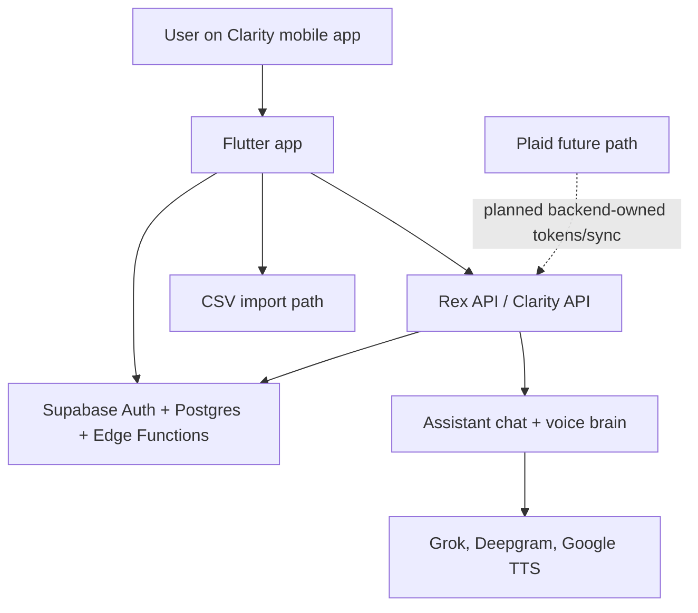

# Clarity Architecture Snapshot

Status: Phase 1 prebuild snapshot  
Last updated: 2026-06-06  
Scope: current app, backend, data, assistant, CSV, Plaid, usage, and design boundaries before unified product rebuilding.

## Executive Summary

Clarity is already mostly organized as one mobile app with feature modules, a Rex API backend, and Supabase as the persisted data layer. The product naming and behavior are not yet fully unified: the mobile shell is called Clarity, the assistant surface still behaves like a Rex mini-app, the backend title still says "Rex Backend", CSV remains the only live financial ingestion path, and Plaid exists only as a fail-closed backend contract.

The best current shared financial truth source is the mobile `FinancialReadModelService`, which loads accounts, transactions, budgets, categories, merchant rules, and statement imports. The assistant receives a mobile-built financial context today, but the long-term target is a shared Clarity read model that backend, mobile, and Assistant all trust.

Usage tracking does not exist yet as a runtime feature. Plaid runtime tables, routes, mobile Link integration, account status screens, and sync jobs do not exist yet. The design system is split: app-level theme is still light/neutral, while the Assistant has separate Rex dark tokens.

## High-Level Runtime Map

## Mobile Surfaces

| Surface | Primary files | Current data owner | Notes |
| --- | --- | --- | --- |
| App bootstrap | `apps/mobile/lib/app/app.dart`, `apps/mobile/lib/app/ui_dependencies.dart` | Supabase Auth, profile, feature services | App title is Clarity, but app-wide theme is not yet the modern dark product theme. `ui_dependencies.dart` is still a broad composition file. |
| Shell navigation | `apps/mobile/lib/features/shell/presentation/home_shell.dart` | Local navigation state | Current tabs: Dashboard, Accounts, Budgets, Assistant, Profile. This is the main place to reframe Clarity as one product. |
| Dashboard | `apps/mobile/lib/features/dashboard/**` | `FinancialReadModelService` | CSV/import state still influences empty states. Future Plaid data should feed the same read model. |
| Accounts | `apps/mobile/lib/features/accounts/**` | `accounts`, `account_statement_imports`, transactions | Accounts are currently local/manual/import-oriented. Plaid connected institutions are not implemented. |
| Transactions + CSV | `apps/mobile/lib/features/transactions/**` | `transactions`, categories, merchant rules, OpenAI edge categorization | CSV is active and should become fallback/import, not the primary connection story. |
| Budgets | `apps/mobile/lib/features/budgets/**`, `features/categories/**` | `budgets`, `categories`, transactions | Budgets depend on the same financial read model and should align with assistant goals/commitments. |
| Assistant | `apps/mobile/lib/features/assistant/**` | Rex API, Supabase assistant tables, mobile financial context | Assistant tabs still create a mini-app feeling: Chat, Voice, Knows, Goals, Chats. Rex tokens are isolated from app theme. |
| Profile | `apps/mobile/lib/features/profile/**` | `profiles`, Supabase Auth | Needs product-level data/privacy framing for multi-user Clarity. |

## Backend Routes And Service Owners

| Route group | Main route file | Main service owners | Current role |
| --- | --- | --- | --- |
| Chat | `services/rex-api/app/routes/chat.py` | `ChatService`, Rex brain services, memory turn services | Main assistant text entry. Normal turns should stay one LLM call. |
| Voice HTTP | `services/rex-api/app/routes/voice.py` | Deepgram service, `ChatService`, Google TTS service | Upload-style voice turn: STT, chat, TTS, voice metadata. |
| Voice WebSocket | `services/rex-api/app/routes/voice_stream.py` | `VoiceStreamSession`, Deepgram streaming, `ChatService`, Google TTS | Streaming voice path. Auth is handled inside the WebSocket route with `authenticate_websocket`. |
| Memory / what Clarity knows | `services/rex-api/app/routes/memory.py` | `MemoryService`, direct memory helpers | Saved facts, corrections, structured memory. Legacy pending candidates are not active product code. |
| Conversations | `services/rex-api/app/routes/conversations.py` | conversation repositories | Chat history. |
| Entities, rules, plans, commitments | `routes/entities.py`, `routes/rules.py`, `routes/plans.py`, `routes/commitments.py` | structured memory repositories/services | Assistant knowledge and goal-like durable records. |
| Accountability | `services/rex-api/app/routes/accountability.py` | accountability/risk services | Goals, risks, patterns, overview. Should become Clarity guidance, not a separate Rex product. |
| Clarity actions | `services/rex-api/app/routes/clarity.py` | `clarity_control_service.py` | Backend action execution/audit surface. |
| Plaid | Not implemented | `plaid_sync_service.py` contract only | No active routes, schema, token exchange, webhooks, or sync jobs yet. |
| Usage | Not implemented | none | No usage event schema, backend tracker, rollups, or admin query contract yet. |

## Supabase Data Groups

| Group | Tables / migrations | Current status |
| --- | --- | --- |
| Auth/profile | `profiles` | Active. RLS exists for user-owned profile rows. |
| Financial core | `accounts`, `categories`, `budgets`, `transactions`, `merchant_category_rules`, `account_statement_imports`, `financial_audit_events` | Active. Mobile reads/writes directly through Supabase services. |
| Assistant core | `conversations`, `messages`, `long_term_memory`, `memory_corrections`, `entities`, `entity_events`, `personal_rules`, `plans`, `plan_milestones`, `commitments`, `voice_turns` | Active. Backend owns most assistant operations. |
| Legacy assistant review | `memory_candidates`, `memory_confirmations`, `memory_candidate_review_sessions` | Archived/dropped by `20260604120456_archive_legacy_rex_memory_review_tables.sql`. Old names remain in historical migrations and legacy docs. |
| Plaid | none yet | Needs new backend-owned tables for items, accounts, sync cursors, sync events, and disconnect state. |
| Usage tracking | none yet | Needs sanitized per-user event table and daily rollups. |

## Boundary Markers

### Plaid

Current state: `services/rex-api/app/services/plaid_sync_service.py` defines a fail-closed service contract with no Plaid SDK dependency, no route, no schema, and no mobile Link integration.

Target boundary: backend owns Plaid secrets, access tokens, item storage, account persistence, transaction sync cursors, webhooks, and disconnect/resync. Mobile only opens Link and submits a public token.

### CSV

Current state: CSV import is active through mobile transaction/account import services and Supabase Edge categorization. It is effectively the current financial ingestion path.

Target boundary: CSV remains "Import CSV instead" fallback. It must write into the same financial tables/read models as Plaid and obey the same deduplication rules.

### Assistant

Current state: Assistant is a full tab with its own sub-tabs and Rex-specific theme/tokens. It gets financial context through mobile-provided snapshots and backend memory/context services.

Target boundary: Assistant is Clarity's intelligence layer. It should answer from the same persisted facts, goals, budgets, accounts, and summaries displayed elsewhere. If Clarity shows a fact, Assistant must not say it does not know it.

### Usage Tracking

Current state: no runtime schema or service.

Target boundary: server-side events for LLM/STT/TTS/API/Plaid latency, counts, status, cost metadata, and errors. Mobile can emit UI feature events. No raw prompts, transcripts, audio, Plaid tokens, account numbers, or transaction descriptions.

### Design System

Current state: `ClarityApp` still defines a light neutral app theme. Assistant uses separate dark Rex tokens in `features/assistant/presentation/rex_ui_tokens.dart`.

Target boundary: one Clarity token system with near-black base, quiet teal/logo accent, off-white text, muted secondary text, and green/red only for financial values.

## Current Risks Before Rebuild

1. Product naming drift: app title is Clarity, backend title is still "Rex Backend", and Assistant UI uses Rex-specific naming/tokens in product-level places.
2. Plaid is not implemented beyond a service contract, so any Plaid UI must wait for backend schema/routes and mobile Link integration.
3. CSV is still the only live ingestion path and appears in older docs as primary behavior.
4. Assistant truth parity is incomplete because backend/mobile read models are not yet unified around a single Clarity context contract.
5. Usage tracking is absent, so there is no reliable per-user visibility into latency, feature usage, voice duration, costs, or errors.
6. App-wide dark/minimal UI is not globally applied; Assistant dark UI is ahead of the rest of the app but still feels separate.
7. Legacy memory-candidate terminology remains in old documentation and historical migrations, even though active product code has been cleaned.

## Phase Ownership Map

| Next plan | Primary ownership established by this snapshot |
| --- | --- |
| Prebuild Foundation | Naming, shared read models, multi-user boundaries, test gates |
| Usage Tracking | New backend schema/service and mobile UI events |
| Plaid Backend Core | New backend-owned Plaid schema, routes, client wrapper, sync, webhooks |
| Plaid Mobile And Account Connection | Connect Bank screens, Link integration, connected institution state |
| Unified Product Shell | Shell navigation, product labels, Assistant-as-capability framing |
| Design System | App-wide dark/minimal tokens and base theme |
| Financial Experience | Dashboard/accounts/transactions/budgets around shared Plaid/CSV data |
| Assistant Intelligence | Shared truth contract, voice/chat parity, memory corrections |
| Release Validation | Final migrations, RLS, automated tests, manual device checks |

## Acceptance Notes

- Mobile surfaces, backend routes, Supabase tables, and service owners are listed above.
- Plaid, CSV, Assistant, usage, and design-system boundaries are explicitly marked.
- This phase changes documentation only. No runtime implementation is modified.
