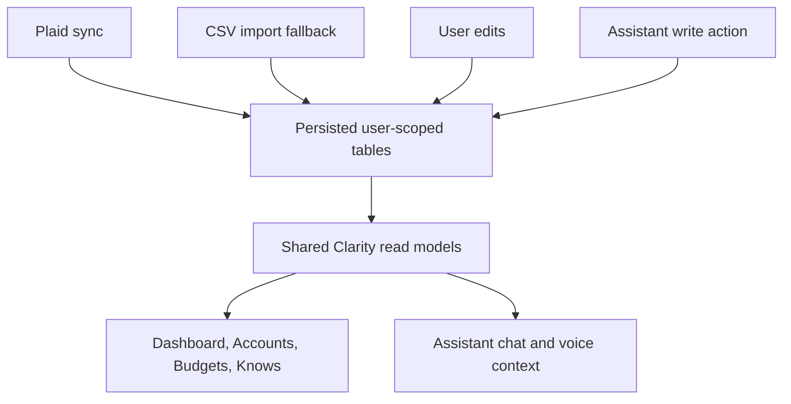

# Clarity Shared Read Models

Status: prebuild contract

Last updated: June 6, 2026

## Purpose

Define the common data snapshots that Clarity screens, Assistant chat, Assistant voice, Plaid sync, CSV import, budgets, goals, and release tests must share. If a fact appears in a Clarity screen, the Assistant must answer from the same read model and must not claim it does not know that fact.

## Core Rule

Writes may come from Plaid sync, CSV import, user edits, Assistant actions, or backend services. Reads must converge through shared Clarity read models.

## Model Ownership

| Read model | Primary owner | Current source | Future source |
| --- | --- | --- | --- |
| User Information | Assistant/user-data backend | Memory, people, rules, plans, commitments routes | Shared user-information endpoint |
| Connected Institutions | Plaid backend + accounts UI | Mobile account records and statement imports | Plaid items, accounts, connection status |
| Financial Activity | Finance domain | `FinancialReadModelService` | Plaid transactions plus CSV fallback rows |
| Budgets And Goals | Budgets + accountability backend | Budget records, plans, commitments, milestones | Unified guidance context |
| Assistant Context | Assistant backend/mobile bridge | Mobile-built financial context + backend memory/accountability context | Server-built context from shared read models |

## Shared Metadata Contract

Every read model response must include:

| Field | Meaning |
| --- | --- |
| `schema` | Stable schema name and version, for example `clarity_user_information_v1`. |
| `user_id` | Owner of the snapshot. Required server-side; mobile may omit only when Supabase session already scopes the request. |
| `generated_at` | UTC timestamp for snapshot creation. |
| `freshness` | `live`, `cached`, `stale`, or `degraded`. |
| `sources` | Sanitized source names such as `plaid`, `csv`, `manual`, `assistant`, `budget`, or `memory`. |
| `load_issues` | Sanitized read errors. No secrets, raw prompts, raw audio, Plaid tokens, or private telemetry. |

## Privacy Boundaries

Read models may include user-visible facts and financial summaries needed by the product. They must never include:

- Plaid `access_token`, `public_token`, processor tokens, item secrets, webhook verification secrets, or raw Plaid request/response bodies.
- Supabase service-role keys, API keys, JWTs, passwords, private SSH material, or credentials.
- Raw voice audio, raw TTS audio, full private transcripts for usage tracking, or raw LLM prompts.
- Usage-tracking cost internals beyond sanitized counts, latency, status, and error class.
- Full account numbers. Display only masked names or last 2-4 digits if already shown to the user.

## User Information Read Model

Schema: `clarity_user_information_v1`

Purpose: what Clarity knows about the user, people, preferences, rules, plans, commitments, and corrections.

Primary current sources:

- `services/rex-api/app/models/memory.py`
- `services/rex-api/app/models/entity.py`
- `services/rex-api/app/models/personal_rule.py`
- `services/rex-api/app/models/plan.py`
- `services/rex-api/app/models/commitment.py`
- `apps/mobile/lib/features/assistant/memory/data/memory_models.dart`

Fields:

| Field | Type | Notes |
| --- | --- | --- |
| `facts` | list | Active long-term facts, preferences, and events. |
| `people` | list | People/places/entities with relationship labels and aliases. |
| `rules` | list | Active personal rules with trigger keywords and priority. |
| `plans` | list | Active plans with title, desired outcome, status, target date, priority. |
| `commitments` | list | Open commitments with title, text, due date, status, linked plan/entity. |
| `corrections` | list | Recently applied corrections with target type/id and new value. |

Freshness expectation:

- Chat/voice Assistant turns: fresh enough for current conversation, preferably loaded per turn when user asks "what do you know" or edits facts.
- What Clarity Knows screen: fresh on screen open, pull-to-refresh, and after edits.
- Background usage tracking must not read or store raw content from this model.

Correction rule:

Corrections update or supersede the existing target record. They must not create duplicate facts for the same canonical subject, such as city spelling or birthday date.

## Connected Institutions Read Model

Schema: `clarity_connected_institutions_v1`

Purpose: show which banks and accounts are connected and whether sync is healthy.

Primary current sources:

- `apps/mobile/lib/core/models/account.dart`
- `apps/mobile/lib/features/accounts/data/account_service.dart`
- `apps/mobile/lib/features/accounts/data/account_statement_import_service.dart`
- Future Plaid item/account tables from `PLAID_BACKEND_CORE_MASTER_PLAN.md`

Fields:

| Field | Type | Notes |
| --- | --- | --- |
| `institutions` | list | Institution id/name, connection state, last successful sync, error class. |
| `accounts` | list | Account id, display name, type, institution id/name, mask if safe, current/available balance if user-visible. |
| `sync_status` | object | Last sync timestamp, next sync hint, degraded sources. |
| `fallback_imports` | list | CSV/import batches by account, month range, count, and source. |

Freshness expectation:

- Accounts screen: fresh on open and after Plaid connect/disconnect/resync.
- Assistant: include summary whenever a user asks about accounts, balance, institution, or financial status.
- Dashboard: may use cached account balances if marked with `generated_at` and `freshness`.

Privacy rule:

Never expose Plaid access tokens, raw item ids beyond backend-safe ids, or full account numbers to mobile or Assistant prompts.

## Financial Activity Read Model

Schema: `clarity_financial_activity_v1`

Purpose: shared transaction/activity truth for Dashboard, Accounts, Budgets, and Assistant financial context.

Primary current sources:

- `apps/mobile/lib/features/finance/application/financial_read_model_service.dart`
- `apps/mobile/lib/features/finance/application/financial_read_model.dart`
- `apps/mobile/lib/core/models/transaction.dart`
- `apps/mobile/lib/features/assistant/data/financial_context_service.dart`

Fields:

| Field | Type | Notes |
| --- | --- | --- |
| `period` | object | Reference month, first/last transaction dates, transaction count. |
| `cash_flow` | object | Total balance, income, spending, available amount, runway if available. |
| `accounts` | list | Account summaries linked to connected institutions. |
| `categories` | list | Category id/name/type/display metadata. |
| `transactions` | list | Selected user-visible rows, never unlimited by default. |
| `transaction_slices` | object | Drilldown indexes by account, month, category, review reason. |
| `statement_imports` | list | CSV/import batch summaries and statement balances. |
| `load_issues` | list | Sanitized errors by source. |

Freshness expectation:

- Dashboard and budgets: fresh on app launch, after account sync, after CSV import, after manual transaction edits.
- Assistant normal turn: summary-first, with small selected rows only when relevant.
- Assistant deep financial question: may request larger slice, still from persisted rows.

Detail limits:

- Default Assistant context should include rollups and selected rows, not the full transaction table.
- Full transaction detail must be user-scoped, paginated, and requested by slice.

## Budgets, Goals, And Commitments Read Model

Schema: `clarity_guidance_v1`

Purpose: align budgets, goals, commitments, and accountability so the Assistant and screens give the same guidance.

Primary current sources:

- `apps/mobile/lib/features/budgets/data/budget_service.dart`
- `apps/mobile/lib/features/budgets/domain/budget_models.dart`
- `services/rex-api/app/routes/accountability.py`
- `services/rex-api/app/models/plan.py`
- `services/rex-api/app/models/commitment.py`
- `apps/mobile/lib/features/assistant/accountability/data/accountability_models.dart`

Fields:

| Field | Type | Notes |
| --- | --- | --- |
| `budgets` | list | Budget id, category, amount, period, current spend, remaining/overspent. |
| `goals` | list | Active plans/goals with status, priority, desired outcome, target date. |
| `commitments` | list | Open tasks/promises/deadlines, due date, source, linked goal. |
| `signals` | list | Sanitized accountability signals with severity and source references. |
| `recent_patterns` | list | Aggregated behavior patterns, not raw private transcripts. |

Freshness expectation:

- Budgets screen: fresh after budget/category/transaction changes.
- Goals/accountability screen: fresh on open and after Assistant creates or updates a commitment.
- Assistant: include when user asks about plans, money decisions, deadlines, habits, or accountability.

Safety rule:

Financial commitments and sensitive goal changes may require confirmation before write, but once written they must appear in the same shared read model screens and Assistant use.

## Assistant Context Snapshot

Schema: `clarity_assistant_context_v1`

Purpose: one compact context package for chat and voice.

Derived from:

- `clarity_user_information_v1`
- `clarity_connected_institutions_v1`
- `clarity_financial_activity_v1`
- `clarity_guidance_v1`
- Recent conversation history

Fields:

| Field | Type | Notes |
| --- | --- | --- |
| `user_information` | object | Selected facts, people, preferences, rules, plans, commitments. |
| `financial_summary` | object | Summary-first account/cash-flow/budget context. |
| `guidance_summary` | object | Goals, commitments, budget risks, signals. |
| `recent_chat` | list | Last 10-20 messages, trimmed. |
| `context_budget` | object | Character/token budget and truncation diagnostics. |

Assistant truth rule:

If Dashboard, Accounts, Budgets, or What Clarity Knows displays a fact, account, budget, goal, plan, or summary, the Assistant must answer from that same source or say the data is temporarily unavailable because of a load issue. It must not invent a separate answer from memory guesses.

Voice parity rule:

Voice must use the same Assistant context snapshot as chat. Voice-specific services may optimize capture, latency, and playback, but they must not bypass shared user information, financial activity, goals, or commitments.

## Write And Refresh Events

These events must invalidate or refresh affected read models:

| Event | Refresh models |
| --- | --- |
| Plaid item connected/disconnected | Connected Institutions, Financial Activity, Assistant Context |
| Plaid transaction sync completed | Financial Activity, Budgets/Goals, Assistant Context |
| CSV import completed/deleted | Financial Activity, Connected Institutions fallback imports, Assistant Context |
| Account edited | Connected Institutions, Financial Activity, Assistant Context |
| Transaction edited/categorized | Financial Activity, Budgets/Goals, Assistant Context |
| Budget edited | Budgets/Goals, Financial Activity, Assistant Context |
| Memory/fact corrected | User Information, Assistant Context |
| Plan/commitment updated | Budgets/Goals, User Information, Assistant Context |

## Phase Ownership For Implementation

| Work | Owning plan |
| --- | --- |
| Usage metadata and safe telemetry fields | `CLARITY_USAGE_TRACKING_MASTER_PLAN.md` |
| Plaid tables, tokens, sync, webhook, RLS | `PLAID_BACKEND_CORE_MASTER_PLAN.md` |
| Connect-bank UI and CSV fallback | `PLAID_MOBILE_AND_ACCOUNT_CONNECTION_MASTER_PLAN.md` |
| Product shell copy and screen placement | `CLARITY_UNIFIED_PRODUCT_SHELL_MASTER_PLAN.md` |
| App-wide modern UI tokens | `CLARITY_DESIGN_SYSTEM_MASTER_PLAN.md` |
| Dashboard/accounts/transactions/budgets consumption | `CLARITY_FINANCIAL_EXPERIENCE_MASTER_PLAN.md` |
| Assistant truth parity, voice parity, corrections | `CLARITY_ASSISTANT_INTELLIGENCE_MASTER_PLAN.md` |
| Final RLS, E2E, device validation | `CLARITY_RELEASE_VALIDATION_MASTER_PLAN.md` |

## Acceptance Checklist

- [x] User information read model is defined.
- [x] Connected institutions/accounts read model is defined.
- [x] Transaction/activity read model is defined.
- [x] Budgets/goals/commitments read model is defined.
- [x] Assistant context is explicitly derived from shared read models.
- [x] Ownership, fields, freshness expectations, and privacy boundaries are documented.
- [x] No read model contains Plaid access tokens or private telemetry content.
