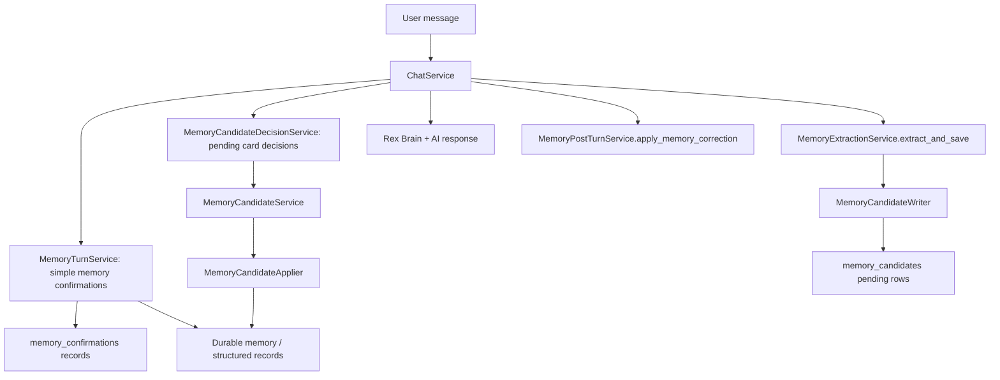

# Rex Memory Phone Test Deep Audit

Status: Active audit

Last updated: June 2, 2026

Related standards:

- `docs/UNIVERSAL_CODE_ARCHITECTURE_STANDARDS.md`
- `docs/templates/MASTER_PLAN_TEMPLATE.md`
- `docs/templates/MODULE_CONTRACT_TEMPLATE.md`
- `docs/templates/ARCHITECTURE_DECISION_RECORD_TEMPLATE.md`

## Purpose

This audit explains why the phone test still creates more pending memories after
chat confirmation, why Rex sometimes sounds like it is confirming memory while
nothing durable changes, and why voice can pause with "Rex is still answering the
previous voice turn."

This is an audit only. The next step should be a focused master plan and then
small, testable fixes.

## Phone Test Symptoms

Observed from the screenshots:

1. The Memory tab shows `Pending (13)`.
2. Rex says pending memories need confirmation before permanent save.
3. The user says: `Yes, we should review and finish all the pending memory.`
4. Rex lists several pending items and asks: `Confirm those as saved?`
5. The user says: `Yes. But Summerville is not like this...`
6. Instead of resolving existing pending items, Rex creates another correction
   candidate.
7. Voice pauses with: `Rex is still answering the previous voice turn.`

## Current Architecture Map

## Key Design Problem

The memory system now has two different confirmation systems:

| System | Table / State | Intended Use | Current Problem |
| --- | --- | --- | --- |
| Simple memory confirmation | `memory_confirmations` | Natural confirmation for simple facts like birthdays | Works in tests, but only for narrow simple facts |
| Pending memory candidates | `memory_candidates` | Review cards for extracted structured memory/corrections | Chat confirmation is too brittle and does not understand natural user language |

The phone test is mostly hitting the second system, not the first. The user is
trying to approve or correct pending Memory-tab cards conversationally, but the
candidate decision parser misses the intent. The message then falls through into
normal chat/correction extraction and creates more pending cards.

## End-To-End Failure Flow

### Flow 1: "Review and finish all pending memory"

1. `ChatService.send_message` saves the user message and checks simple memory
   first.
2. No simple memory confirmation is detected.
3. `MemoryCandidateDecisionService.handle_decision` runs.
4. The phrase `Yes, we should review and finish all the pending memory` does not
   match approve-all because approve-all requires words like approve/apply/save.
5. The message falls through to Rex Brain.
6. Rex can talk about pending memories and ask confirmation, but no backend write
   happened.
7. If extraction runs after the response, it may create more pending candidates.

Relevant code:

- `services/rex-api/app/services/chat_service.py:130`
- `services/rex-api/app/services/chat_service.py:140`
- `services/rex-api/app/services/memory_candidate_decision_service.py:165`
- `services/rex-api/app/services/memory_candidate_decision_service.py:173`

### Flow 2: "Yes, but Summerville..."

1. The user appears to confirm but also correct one item.
2. `MemoryCandidateDecisionService` does not recognize the mixed intent.
3. `MemoryPostTurnService.apply_memory_correction` detects a correction.
4. A new high-risk `correction` candidate is created.
5. The original pending candidates remain pending.
6. The pending count increases.

Relevant code:

- `services/rex-api/app/services/memory_candidate_decision_service.py:187`
- `services/rex-api/app/services/memory_post_turn_service.py:25`
- `services/rex-api/app/services/memory_post_turn_service.py:60`

### Flow 3: Voice "still answering previous turn"

1. Voice streaming creates an active backend turn task.
2. If the mobile client sends another `utterance.end` before the backend clears
   the active task, the backend returns `turn_in_progress`.
3. The mobile controller is responsible for lifecycle, capture, playback,
   background handling, transcript buffers, stream session state, and retry
   behavior in one large file.
4. App lifecycle resume/background behavior can force another utterance end or
   restart while the previous turn is still processing.

Relevant code:

- `services/rex-api/app/services/voice_stream_session.py:149`
- `services/rex-api/app/services/voice_stream_session.py:150`
- `apps/mobile/lib/features/assistant/voice/application/voice_call_controller.dart:965`
- `apps/mobile/lib/features/assistant/voice/application/voice_call_controller.dart:1010`
- `apps/mobile/lib/features/assistant/voice/application/voice_call_controller.dart:1021`
- `apps/mobile/lib/features/assistant/voice/application/voice_call_controller.dart:1058`

## Standards Violations

| Violation | Evidence | Impact |
| --- | --- | --- |
| Hidden/implicit action contract | Rex asks to confirm pending memory, but only exact parser phrases mutate records | User thinks confirmation happened when it did not |
| Silent failure | Missed candidate decision falls through to AI instead of saying "I need a clearer command" | Pending count grows |
| God-file | `voice_call_controller.dart` is 1,908 lines | Voice race conditions are hard to isolate |
| God-service risk | `chat_service.py` is 498 lines and owns many turn gates | One missed ordering rule changes user-visible behavior |
| Conflicting memory rules | Extraction prompt says corrections should be applied, backend stores correction candidates | Model/backend behavior drift |
| Brittle natural language parser | Candidate decision parser uses phrase lists only | Real user confirmation wording fails |
| Duplicate prevention too local | Candidate duplicate search is only same candidate type + same conversation | Similar pending cards can still accumulate |

## File Size And Responsibility Audit

| File | Lines | Status | Responsibility Concern |
| --- | ---: | --- | --- |
| `apps/mobile/lib/features/assistant/voice/application/voice_call_controller.dart` | 1,908 | Critical god-file | Lifecycle, capture, playback, streaming, state, errors |
| `apps/mobile/lib/features/assistant/chat/presentation/widgets/chat_message_bubble.dart` | 811 | Over limit | Rendering plus candidate/action UI complexity |
| `apps/mobile/lib/features/assistant/chat/presentation/pages/chat_page.dart` | 658 | Over limit | Page layout plus chat interactions |
| `services/rex-api/app/services/voice_stream_session.py` | 612 | Over limit | WebSocket protocol, STT, chat, TTS, turn lifecycle |
| `services/rex-api/app/services/chat_service.py` | 498 | At hard limit | Main chat orchestration with too many gates |
| `services/rex-api/app/services/memory_service.py` | 496 | At hard limit | Facade still owns many repository mixins |
| `services/rex-api/app/services/memory_turn_service.py` | 481 | Near hard limit | Simple memory orchestration and summaries |
| `services/rex-api/app/services/memory_candidate_decision_service.py` | 289 | Acceptable size | Logic is too brittle, but file size is okay |

## Root Causes

### Root Cause 1: Candidate confirmations are not explicit enough

The simple memory path now uses explicit `memory_confirmations`, but candidate
approval from chat does not have a conversation-level pending decision contract.
It relies on parsing free-text commands every turn.

Current accepted examples:

- `approve all pending`
- `confirm`
- `save that`
- `confirm memory candidate <id>`

Rejected by current parser even though users naturally say them:

- `Yes, let's finish all the pending memory.`
- `Yes, we should review and finish all the pending memory.`
- `Yes, but fix Summerville first.`
- `Confirm those as saved.`

### Root Cause 2: Mixed approval plus correction is unsupported

The user can naturally say "yes, but one item needs correction." The current
system treats that as a correction candidate creation, not as an update to the
existing pending candidate set.

The missing concept is an explicit "pending review session" with selected
candidate IDs and editable proposed changes.

### Root Cause 3: Rex can ask for confirmation without a backend-pending action

Rex Brain can produce text like "Confirm those as saved?" when no backend action
contract exists. This violates the standard that mutations must be backed by
explicit state.

### Root Cause 4: Extraction is allowed after memory meta-discussion

Conversation about memory review can be sent to the extractor. The extractor
prompt says not to save assistant summaries, but the user text itself can contain
memory-like phrases. That creates noise unless memory-management turns are
excluded from extraction.

### Root Cause 5: Voice turn concurrency is split across client and server

The backend correctly rejects overlapping turns, but the mobile client can still
produce overlapping lifecycle/end events. The controller is too large to make
this invariant obvious.

## Immediate Fix Recommendations

### 1. Create a `MemoryCandidateReviewSession`

Priority: P0

Effort: 0.5-1 day

Create explicit review-session state for chat-driven pending candidate approval.
When Rex says "these pending items," it must reference exact candidate IDs.

Done looks like:

- User says `review pending memories`.
- Backend creates or returns a review session with selected candidate IDs.
- Rex response is generated by backend, not open-ended AI.
- Follow-up `yes`, `confirm those`, or `save them` applies the session.

### 2. Expand candidate decision intent safely

Priority: P0

Effort: 2-4 hours

Before deeper refactor, add tests for the real phone phrases:

- `Yes, we should review and finish all the pending memory.`
- `Confirm those as saved.`
- `Yes, but Summerville is Summerville City in Massachusetts.`

The third phrase should not create a new unrelated correction candidate. It
should either update the selected pending candidate or ask one clarification.

### 3. Block post-turn extraction on memory-management turns

Priority: P0

Effort: 2-4 hours

If a turn is about approving, rejecting, listing, editing, or correcting pending
memory candidates, do not run general memory extraction. This prevents pending
count growth from meta-conversation.

### 4. Align correction prompt with backend behavior

Priority: P1

Effort: 1-2 hours

Update the prompt and correction response contract so Rex says:

- "I created a correction for review."
- Not "I updated it" unless approval and verification succeeded.

### 5. Refactor voice turn state machine

Priority: P1

Effort: 1-2 days

Split `voice_call_controller.dart` before adding more voice fixes. Suggested
modules:

- `voice_lifecycle_coordinator.dart`
- `voice_stream_turn_coordinator.dart`
- `voice_transcript_buffer.dart`
- `voice_error_recovery_policy.dart`
- `voice_playback_coordinator.dart`

The first bug fix should prevent `utterance.end` on resume while backend active
turn state is still in progress.

## Proposed Next Master Plan

Create `MEMORY_CANDIDATE_REVIEW_RELIABILITY_MASTER_PLAN.md` with these phases:

1. Write failing tests for the exact phone-test phrases.
2. Add memory-management turn classifier.
3. Prevent extraction on memory-management turns.
4. Add explicit candidate review session state.
5. Support approve-all, reject-all, and mixed approve-with-edit.
6. Make Rex responses backend-authored for candidate review turns.
7. Add mobile refresh after candidate decisions.
8. Add voice overlap tests and then split/fix voice state.

## Acceptance Criteria For The Next Fix

- Pending count does not increase when the user tries to approve pending memory.
- `Yes, we should review and finish all the pending memory` produces a backend
  candidate-review response, not generic AI.
- `Confirm those as saved` applies eligible pending candidates or clearly says
  which high-risk candidates require individual confirmation.
- `Yes, but Summerville...` updates the pending correction/review flow instead
  of creating another unrelated pending card.
- Voice does not send a second `utterance.end` while a backend turn is active.
- Tests cover the phone-test conversation exactly.

## Audit Conclusion

The recent simple-memory confirmation work improved one path, but the phone test
is exposing the older pending-candidate path. The system is not broken because
Supabase writes fail; it is broken because the user-facing conversation implies
an explicit confirmation workflow that the backend has not modeled explicitly.

The correct fix is not more prompt polish. The correct fix is explicit candidate
review session state, stricter extraction gating, and a smaller voice state
machine.
