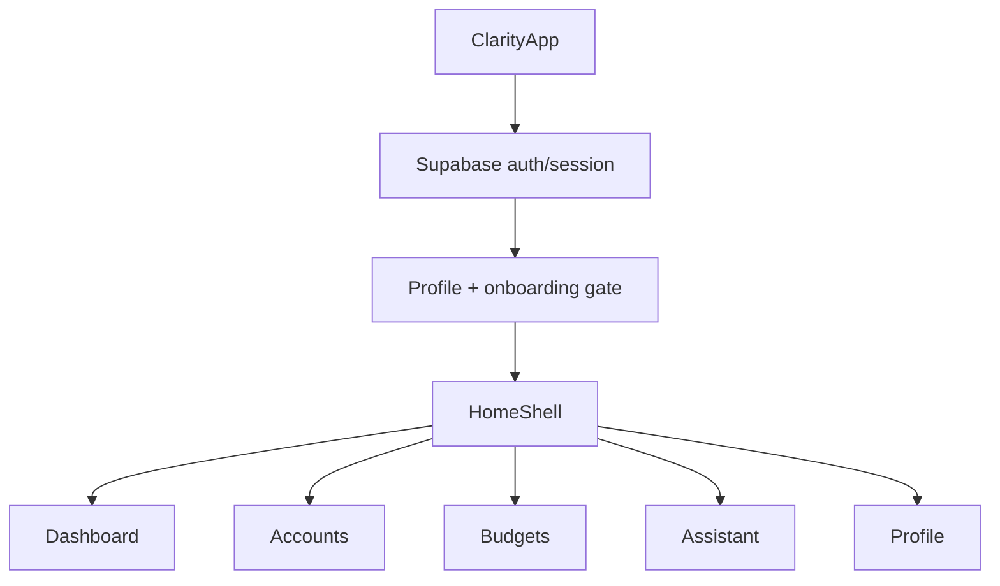

# Clarity Screen/Data Map

Status: prebuild architecture map
Last updated: 2026-06-06
Purpose: describe the current screen-to-data ownership before Plaid, unified product shell, app-wide design, usage tracking, and Assistant truth work.

## App-Level Flow

## Shared Financial Read Model

Primary files:

- `apps/mobile/lib/features/finance/application/financial_read_model_service.dart`
- `apps/mobile/lib/features/finance/application/financial_read_model.dart`
- `apps/mobile/lib/features/finance/application/financial_read_model_helpers.dart`
- `apps/mobile/lib/app/ui_dependencies.dart`

Current inputs:

- `accounts`
- `transactions`
- `budgets`
- `categories`
- `merchant_category_rules`
- `account_statement_imports`

Current consumers:

- Dashboard
- Accounts/account detail
- Budgets
- Assistant financial context provider

Target rule: Plaid and CSV must both persist into the same financial tables/read model. Assistant should consume the same Clarity financial truth as Dashboard, Accounts, Transactions, and Budgets.

## Screen Map

| Screen / area | Primary files | Reads | Writes / actions | Notes |
| --- | --- | --- | --- | --- |
| App bootstrap | `apps/mobile/lib/app/app.dart` | Auth session, profile status | Profile initialization | Product title is Clarity. Theme still needs app-wide dark/minimal modernization. |
| Home shell | `apps/mobile/lib/features/shell/presentation/home_shell.dart` | Local tab state | Refreshes UI controllers on app resume | Current tabs are Dashboard, Accounts, Budgets, Assistant, Profile. |
| Dashboard | `apps/mobile/lib/features/dashboard/presentation/dashboard_screen.dart`, `financial_dashboard_view.dart`, dashboard domain files | `FinancialReadModelService` through `DashboardUiController` | Opens import/account/category flows | Should become daily financial clarity, not CSV-first status. |
| Accounts list | `apps/mobile/lib/features/accounts/presentation/accounts_screen.dart` | `AccountService`, financial read model | Add/manage account, import status refresh | Future primary CTA should be Connect Bank. |
| Account detail | `apps/mobile/lib/features/accounts/presentation/account_detail_screen.dart` | Account-scoped transactions/read model | Account-specific import/action flows | Future Plaid account details should show institution, sync state, disconnect/resync. |
| Transactions/import | `apps/mobile/lib/features/transactions/presentation/upload_screen.dart`, transaction data/application files | Selected account, categories, merchant rules | Inserts/updates transactions, categories, import status | CSV is live today. It should become fallback: "Import CSV instead." |
| Budgets | `apps/mobile/lib/features/budgets/presentation/budgets_screen.dart`, budget viewmodels/widgets | Budgets, categories, transactions via read model | Create/update/delete budgets, category management | Should align with Assistant goals, commitments, and guidance. |
| Assistant shell | `apps/mobile/lib/rex/presentation/assistant_screen.dart` | Local tab state, Rex theme tokens | Switches Assistant sub-tabs | Still feels like a nested Rex product. Needs Clarity intelligence framing. |
| Assistant chat | `apps/mobile/lib/rex/chat/**` | Rex API `/chat`, conversations/messages, mobile financial context | Sends messages, optional streaming, memory changes | Must use exactly one normal-turn LLM call and shared Clarity context. |
| Assistant voice | `apps/mobile/lib/rex/voice/**` | Rex API `/voice/turn` and `/voice/stream` | Captures audio, transcribes, speaks responses, saves voice turn metadata | Voice is primary. It must use same brain/data path as chat. |
| What Rex/Clarity knows | `apps/mobile/lib/rex/memory/**` | Rex API `/memory`, entities/rules/plans/commitments as applicable | Edit/archive/update known facts | UI should become "What Clarity Knows" or "My Information"; no pending cards. |
| Goals/accountability | `apps/mobile/lib/rex/accountability/**` | Rex accountability routes, plans, commitments | Goal/plan/commitment changes | Should be unified with budgets and Clarity guidance. |
| Conversation history | `apps/mobile/lib/rex/chat/presentation/pages/conversation_list_page.dart` | Rex API `/conversations` | Open/delete conversations | Should feel like Assistant history inside Clarity, not separate product navigation. |
| Profile/settings | `apps/mobile/lib/features/profile/**` | `profiles`, Auth | Update profile, sign out | Needs data/privacy controls for Plaid, CSV, Assistant, and usage tracking. |

## Backend Data Map For Assistant Screens

| Mobile feature | Backend routes | Backend tables |
| --- | --- | --- |
| Chat | `/chat`, `/conversations`, `/conversations/{id}/messages` | `conversations`, `messages`, `long_term_memory`, structured assistant tables |
| Voice | `/voice/transcribe`, `/voice/turn`, `/voice/synthesize`, WebSocket `/voice/stream` | `voice_turns`, conversations/messages |
| Knows / user information | `/memory`, `/memory/corrections`, `/entities`, `/rules`, `/plans`, `/commitments` | `long_term_memory`, `memory_corrections`, `entities`, `entity_events`, `personal_rules`, `plans`, `plan_milestones`, `commitments` |
| Goals/accountability | `/accountability/*`, `/plans`, `/commitments` | `plans`, `plan_milestones`, `commitments`, assistant memory/entity tables |

## Current Ingestion Paths

### CSV

Current status: implemented and active.

Key files:

- `apps/mobile/lib/features/transactions/data/csv_import_service.dart`
- `apps/mobile/lib/features/transactions/data/csv_transaction_parser.dart`
- `apps/mobile/lib/features/transactions/presentation/upload_screen.dart`
- `apps/mobile/lib/features/accounts/data/account_statement_import_service.dart`
- `supabase/functions/categorize-transactions/index.ts`

Writes:

- `transactions`
- `account_statement_imports`
- categories/merchant rules where applicable
- financial audit events where applicable

Future role: fallback/import option only.

### Plaid

Current status: contract only, not implemented.

Key file:

- `services/rex-api/app/services/plaid_sync_service.py`

Missing pieces:

- Plaid config and secret loading
- Plaid tables/RLS
- Link token route
- Public token exchange route
- Item/account persistence
- Transaction sync cursor
- Webhook handling
- Native mobile Link integration
- Connect Bank screens
- Disconnect/resync UI

Future role: default bank connection and transaction ingestion.

## Planned Usage Tracking Map

Current status: not implemented.

Planned event sources:

- Backend API latency and error events
- LLM turn usage and latency
- STT/TTS duration and latency
- Plaid sync/link/disconnect events
- Mobile UI feature events

Never store:

- raw prompts
- transcripts
- audio
- Plaid tokens
- account numbers
- transaction descriptions
- private message content

## Data Direction Rules

1. UI screens should read from feature controllers/services, not raw Supabase queries inside widgets.
2. Dashboard, Accounts, Transactions, Budgets, and Assistant should converge on shared Clarity read models.
3. Plaid and CSV write into the same persisted financial model.
4. Assistant may summarize financial/user data, but it must not invent separate memory guesses when Clarity already has persisted truth.
5. Voice and chat must use the same Assistant brain/data path.
6. Usage events must be sanitized before persistence.
7. App-wide design tokens must replace Assistant-only Rex tokens over time.
8. Manual validation stays last; subsystem plans should own their own automated checks.
