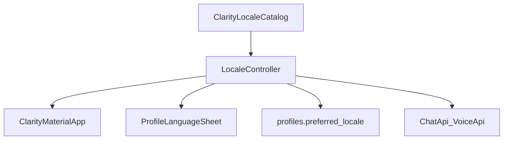

# Phase S1 — Locale Catalog & Full Locale Matching

## Goal

Replace scattered locale lists with one catalog and make full locale tags (`pt-BR`, `pt-PT`, `es`) work end-to-end before any new translations ship.

## Target End State

- One catalog defines every supported locale, native label, ARB file, and whether it is enabled in the profile picker.
- Only **English is enabled** for users (`enabled: true`); other locales exist structurally but are disabled until their language phase.
- Device locale resolves through a fallback chain: exact tag → language-only → `en`.
- Saved `preferred_locale` and profile sync use full BCP-47 tags.
- No UI redesign — profile language sheet stays a minimal bottom sheet.

## Current Gaps

- [`claritySupportedLocales`](../../apps/mobile/lib/features/profile/application/locale_controller.dart) is a hardcoded list duplicated from gen-l10n.
- `_resolveSupported()` matches `languageCode` only — cannot distinguish `pt-BR` vs `pt-PT`.
- Profile picker compares `languageCode`, not full tag.
- [`actionResultMessageFormatterProvider`](../../apps/mobile/lib/app/app.dart) uses `Locale(languageCode)` instead of full locale.

## Architecture

## Files to Create

- [`apps/mobile/lib/core/l10n/clarity_locale_catalog.dart`](../../apps/mobile/lib/core/l10n/clarity_locale_catalog.dart)
  - `ClarityLocaleSpec`: `Locale locale`, `nativeLabel`, `enabled`, optional `arbFile`
  - `kClarityLocaleCatalog`: all known locales (en enabled; es/pt-BR/pt-PT/fr entries disabled)
  - `enabledLocales`, `resolveLocale(Locale input)`, `labelFor(Locale)`, `localeTagFor(Locale)`

## Files to Modify

- [`apps/mobile/lib/features/profile/application/locale_controller.dart`](../../apps/mobile/lib/features/profile/application/locale_controller.dart)
  - Remove `claritySupportedLocales` constant; read from catalog
  - Replace `_resolveSupported` with catalog `resolveLocale`
  - Compare full tags in profile sync paths
- [`apps/mobile/lib/core/l10n/app_locale.dart`](../../apps/mobile/lib/core/l10n/app_locale.dart) — export catalog helpers
- [`apps/mobile/lib/core/l10n/clarity_material_app.dart`](../../apps/mobile/lib/core/l10n/clarity_material_app.dart) — `supportedLocales` from enabled + registered ARB locales
- [`apps/mobile/lib/features/profile/presentation/profile_screen.dart`](../../apps/mobile/lib/features/profile/presentation/profile_screen.dart) — iterate `enabledLocales` only; compare `localeTag`
- [`apps/mobile/lib/app/app.dart`](../../apps/mobile/lib/app/app.dart) — formatter uses `localeController.locale`, not `languageCode` only
- [`apps/mobile/test/locale_controller_test.dart`](../../apps/mobile/test/locale_controller_test.dart) — add pt-BR/pt-PT resolution tests

## Step-by-Step Work Plan

### 1. Define locale catalog

- Add specs for: `en`, `es`, `pt-BR`, `pt-PT`, `fr` (only `en` enabled).
- Native labels in each language (e.g. `Português (Brasil)`), shown in picker when enabled.

### 2. Refactor LocaleController

- Boot: saved tag → device tag → `en`.
- `resolveLocale` fallback: exact match → same language without region → `en`.
- Persist full tag to SharedPreferences and profile.

### 3. Wire UI and providers

- Profile picker lists `catalog.enabledLocales` only.
- MaterialApp `supportedLocales` includes all locales with ARB delegates (gen-l10n may still only have `en` + stub `es` until L1).

### 4. Temporarily disable Spanish in picker

- Keep [`app_es.arb`](../../apps/mobile/lib/l10n/app_es.arb) file but set `es` spec `enabled: false` until L1.
- Device set to Spanish falls back to English UI until L1 enables `es`.

## Acceptance Criteria

- [ ] Single catalog is the only place locale metadata is defined.
- [ ] `pt-BR` and `pt-PT` resolve distinctly when both are in catalog.
- [ ] Profile picker shows English only.
- [ ] Changing language persists full tag (e.g. `en`, not stripped).
- [ ] Rex APIs still receive `AppLocale.rexLocaleTag()` correctly.

## Verification

- `flutter test test/locale_controller_test.dart`
- `flutter test test/app_routing_test.dart --name "profile and security"`
- Manual: Profile → Language shows English only; app remains English on Spanish device.

## Deferred

- Enabling Spanish/Portuguese/French in picker (L1+)
- S2 ARB migration
- Backend locale registry changes (S4)
