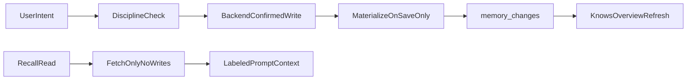

# Memory Refactor Master Plan

## Goal

Fix the broken memory system, align Knows with backend truth, and refactor structure before new features. One durable memory source of truth for Rex prompts and the Knows tab.

## Plan Files (execute in order)

1. [`01_PHASE_M0_STABILIZE_TRUTH.md`](01_PHASE_M0_STABILIZE_TRUTH.md) — fix Knows/backend drift bugs
2. [`02_PHASE_M1_LIFECYCLE_AND_CREATE.md`](02_PHASE_M1_LIFECYCLE_AND_CREATE.md) — write lifecycle, discipline wiring, manual Knows create
3. [`03_PHASE_M2_SPLIT_GOD_FILES.md`](03_PHASE_M2_SPLIT_GOD_FILES.md) — behavior-neutral file splits
4. [`04_PHASE_M3_MOBILE_ENTITY_ALIGNMENT.md`](04_PHASE_M3_MOBILE_ENTITY_ALIGNMENT.md) — full entity model, i18n, pagination
5. [`05_PHASE_M4_DEAD_CODE_CLEANUP.md`](05_PHASE_M4_DEAD_CODE_CLEANUP.md) — orphans, scripts, doc cleanup

Execute **one plan file at a time**, in order. Do not start M1 until M0 acceptance criteria pass.

## Authority

- [`docs/MEMORY_RECALL_SOURCE_OF_TRUTH.md`](../MEMORY_RECALL_SOURCE_OF_TRUTH.md)
- [`docs/brain/REX_BRAIN_RULES.md`](../brain/REX_BRAIN_RULES.md)
- [`docs/project-completion/03_REX_MEMORY_AND_RECALL_PLAN.md`](../project-completion/03_REX_MEMORY_AND_RECALL_PLAN.md) — historical recall goals; execution follows this master plan

## Principles

- Saved memory is durable only after backend confirmation.
- Chat history is not saved memory.
- Knows shows backend-confirmed categorized memory only.
- Voice and chat use the same memory path.
- Reads fetch; writes mutate. No DB writes during recall context load.
- No topic-specific recall or memory patches.

## Locked Product Decisions

- **Knows manual create:** Yes — people, facts, preferences, rules, plans, commitments via backend-confirmed API writes.
- **MemoryDisciplineService:** Wire into save/create hot paths (M1).

## Architecture Target



## Execution Gates

| Phase | Gate |
|-------|------|
| M0 | Knows matches backend after save/edit/archive; read path does not mutate DB |
| M1 | Discipline runs on creates; Knows can create records; lifecycle documented |
| M2 | All god files under 500 lines; existing memory tests pass |
| M3 | All entity types in Knows; MemoryLayer removed; labels in ARB |
| M4 | No orphaned discipline/verification code; one backfill script |

## Verification (per phase)

Each phase file lists its own commands. Baseline suite:

```bash
# Backend memory truth
cd services/rex-api
python -m pytest tests/test_memory_turn_service.py tests/test_memory_reliability_flow.py tests/test_brain_trust_e2e.py tests/test_memory_retrieval.py -q

# Mobile Knows
cd apps/mobile
flutter test test/memory_page_test.dart test/memory_page_archive_errors_test.dart test/memory_api_test.dart test/memory_label_test.dart
```

## Deferred (not in M0–M4)

- Recall ranking/excerpt quality (Plan 03 recall section)
- Hybrid chat search ([`REX_BRAIN_HYBRID_CHAT_SEARCH.md`](../brain/REX_BRAIN_HYBRID_CHAT_SEARCH.md))
- Entity event timeline UI
- User-facing corrections history tab
- Voice locale smoke testing
- Renaming `SupabaseMemoryService` facade (document only unless low-risk in M4)
