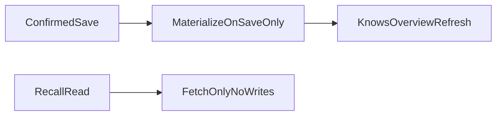

# Phase M0 — Stabilize Memory Truth

## Goal

Fix user-visible Knows/backend drift before structural refactors. No big renames or new features.

## Prerequisites

- None — start here.

## Current Gaps

- **Read-path writes:** `get_structured_memory_context()` and `list_entities()` call `materialize_from_active_memories()`, mutating DB during recall/list.
- **Person archive resurrection:** Archiving a person card removes them from mobile dedup; linked flat memories reappear in Knows.
- **Stale Knows refresh:** Structured edits call `loadMemories(layer: …)` instead of `loadSavedOverview()`.

## Target End State



## Files to Modify

### Backend

- [`services/rex-api/app/services/memory_retrieval_service.py`](../../services/rex-api/app/services/memory_retrieval_service.py) — remove materialization from `get_structured_memory_context()`
- [`services/rex-api/app/services/entity_service.py`](../../services/rex-api/app/services/entity_service.py) — remove materialization from `list_entities()`; archive linked flat memories on `deactivate_entity()`
- [`services/rex-api/app/services/person_memory_materializer.py`](../../services/rex-api/app/services/person_memory_materializer.py) — add helper to archive source memories when entity is deactivated

### Mobile

- [`apps/mobile/lib/rex/memory/application/memory_action_controller.dart`](../../apps/mobile/lib/rex/memory/application/memory_action_controller.dart) — use `loadSavedOverview()` after all structured mutations
- [`apps/mobile/lib/rex/memory/presentation/widgets/memory_page_filters.dart`](../../apps/mobile/lib/rex/memory/presentation/widgets/memory_page_filters.dart) — hide flat rows covered by archived persons when `activeOnly` is false (defense in depth)

## Files to Create

- [`services/rex-api/tests/test_memory_read_path_no_writes.py`](../../services/rex-api/tests/test_memory_read_path_no_writes.py) — assert read paths do not call materializer
- [`apps/mobile/test/memory_page_person_archive_dedup_test.dart`](../../apps/mobile/test/memory_page_person_archive_dedup_test.dart) — person archive does not resurrect flat duplicates

## Step-by-Step Work Plan

### 1. Remove read-path materialization

- Delete `materialize_from_active_memories()` calls from retrieval and entity list paths.
- Keep materialization on confirmed save in `memory_turn_service` / `person_memory_materializer.materialize_from_memory()`.

### 2. Archive linked flat memory on person deactivate

- When `deactivate_entity()` runs for a person, deactivate all `source_memory_ids` from entity metadata (and attribute source ids).
- Idempotent if memories already archived.

### 3. Fix mobile refresh

- Replace every `loadMemories(layer: …)` in `memory_action_controller.dart` with `loadSavedOverview(activeOnly: state.activeOnly)`.

### 4. Defense-in-depth mobile dedup

- In `filterSavedMemory`, also hide flat memories whose `metadata.canonical_entity_id` points to a person still in state (active or inactive when showing archived).

### 5. Tests

- Backend: read-path no materializer calls.
- Mobile: person archive dedup regression.
- Extend archive error tests if needed.

## Acceptance Criteria

- [x] `get_structured_memory_context()` does not call `materialize_from_active_memories()`.
- [x] `list_entities()` does not call `materialize_from_active_memories()`.
- [x] Deactivating a person archives linked flat `long_term_memory` rows.
- [x] Knows structured edit/archive refreshes full overview, not single layer.
- [x] Archiving a person card does not resurrect linked flat memories in Knows.
- [x] Existing memory truth tests still pass.

## Verification

```bash
cd services/rex-api
python -m pytest tests/test_memory_read_path_no_writes.py tests/test_memory_turn_service.py tests/test_memory_reliability_flow.py tests/test_brain_trust_e2e.py tests/test_memory_retrieval.py tests/test_entity_service.py -q

cd apps/mobile
flutter test test/memory_page_test.dart test/memory_page_archive_errors_test.dart test/memory_page_person_archive_dedup_test.dart
```

## Manual Smoke

1. Save a person fact via Rex chat; confirm person card in Knows (may require re-open or refresh until M1).
2. Archive the person card; confirm linked flat fact does not reappear.
3. Edit a rule in Knows; confirm all groups stay consistent.
4. Ask Rex a recall question; confirm no unexpected entity creation in DB.

## Deferred

- Manual Knows create (M1)
- Discipline wiring (M1)
- God-file splits (M2)
