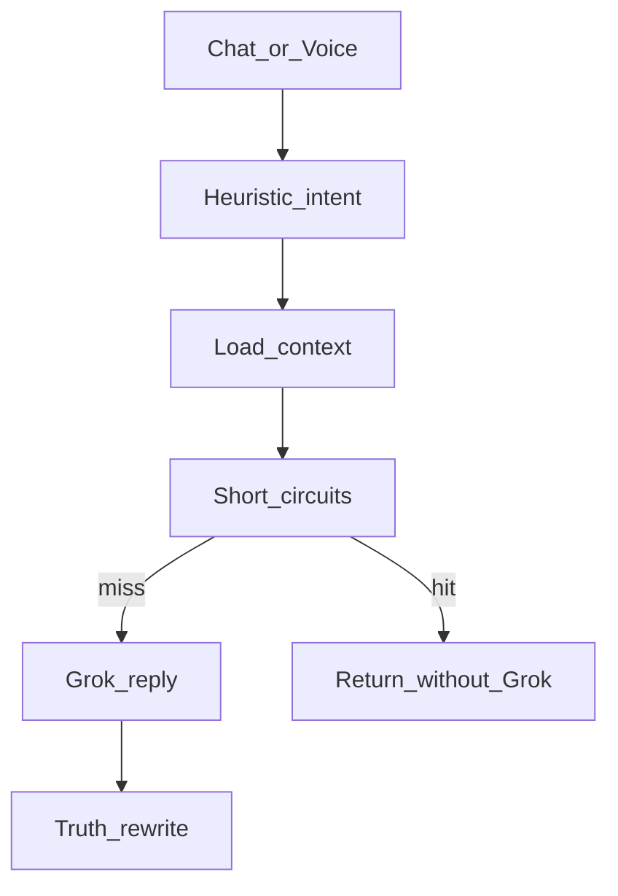

# 01 — Vision, gap, and token budget

**Status:** Phases A–D complete (2026-07-17). Gap scorecard + base token aim accepted; proceed to plan 02.  
**Code changes in this plan:** none (read-only audit).

## 1. Locked vision

Clarity’s assistant is **simple**:

| Layer | Role |
|-------|------|
| **Brain** | Grok as **LLM only** — understands and reasons every turn. No long persona prompt. |
| **Voice out** | **Google TTS** speaks replies (not Grok speech). |
| **Body** | Backend features — the only things that can fetch data or mutate state. |
| **Gate** | Auto Suggestions (Off / Text / Card) + kind toggles — applied **after** Grok’s meaning, not as language detectors. |
| **Honesty** | Truth Rule — never claim saved/updated/sent unless the body applied it this turn. |

### Target pipeline

```text
Chat/Voice → ChatService → Orchestrator
  → tiny system (Truth + Off/Text/Card + capability NAMES)
  → thin state (recent turns + open thread titles if any)
  → Grok thinks → structured action(s) | just_chat | unsupported
  → fetch capability if needed (finance / person / recall)
  → Auto Suggestions gate → body execute → Truth → reply
```

One understanding path. Many capability handlers. No competing heuristic brains.

### What we are not building

- Regex / phrase / overlap / embedding layers that **understand** the user instead of Grok.
- Always-on finance or Knows dumps.
- A second LLM call on the phone before the API.
- Prompt-crafted “Rex personality” essays.
- Reply-length controls (concise/balanced/detailed) that reshape Grok’s natural answers — **remove from product** (UI + `response_style` prompt injection + token caps). Kill in plans 02/04/05; do not reintroduce.

## 2. Token budget (base &lt; ~1k; flexible with tools)

**Standard:** aim for **under ~1k tokens** of model **input** on a normal base turn (system + thin state + recent chat).

**Not a forever hard cap:** when the user (or Grok via actions) needs tools / heavy fetch / large grounded packs, the turn **may exceed 1k**. Cost control = keep the **base** thin; grow only when the situation requires it.

| Piece | Budget guide | Notes |
|-------|--------------|--------|
| Capability **names** only | ~80–150 | No long descriptions |
| Truth + Off/Text/Card + kind flags | ~100–200 | No reply-length style block |
| Recent chat window | ~300–500 | Cap turns / chars |
| Open thread titles (≤5) | ~50–100 | Titles only unless fetch |
| **Base total** | **Aim &lt; ~1k** | Standard, not a rigid forever ceiling |
| Fetch / tool packs | Extra as needed | Situation-dependent |

**Fetch-on-demand (not always-on):**

- Finance summary / transactions / account balances
- Full person card + recent notes / shared history
- Chat recall search hits
- Knows / Goals inventory lists

## 3. Slim capability catalog (names only)

Catalog in the system prompt is **identifiers**, not manuals. Body must actually implement each name.

### Memory / people

- `save_memory` / `update_memory` / `delete_knows_item`
- `save_person` / `update_person_state`
- `add_person_note` (related note on a person — part of the person card story)
- `save_connection` / `save_shared_history` (when Knows UI exists — Truth Rule)
- `fetch_person_context`
- `search_chats` / `list_knows_summary`

### Goals / open threads / milestones

- `create_goal` / `update_goal` / `delete_goal`
- `create_milestone` / `update_milestone` / `delete_milestone` (under a plan)
- `create_open_thread` / `update_open_thread` / `delete_open_thread`
- Milestones stay in the catalog; **implement basics in plan 05 late phases** (after core goals/threads)

### Finance (must match manual UI)

- `fetch_spend_insight` / `fetch_account_summary`
- `categorize_transaction` / `bulk_categorize`
- `create_category` / `update_category` / `delete_category`
- `create_budget` / `update_budget` / `delete_budget`
- Plaid connect/disconnect and CSV import as body capabilities that match real app flows
- **No** `create_transaction` if users cannot create txs outside Plaid/CSV import

### Meta

- `just_chat`
- `unsupported` (email, SMS, external world, …)

## 4. Person memory model (light state, full insight)

Problem: hours of talk about a co-worker, then “what happened today” — without stuffing transcripts into every turn.

| Store | Content | When loaded |
|-------|---------|-------------|
| **Person card state** | Short confirmed summary of who they are + current relational status | `fetch_person_context` or mention-triggered fetch |
| **Person notes / shared history** | Discrete confirmed moments (light bullets) | Same fetch, capped |
| **Chat history** | Full detail via `search_chats` | When user asks or state is insufficient |
| **Flat memory** | Non-person facts only; must not duplicate/conflict with person cards | Duplicates are **deleted**, not archived |

After many events, Grok **proposes** updating `update_person_state` (+ optional note). User confirms. Next “today” turn uses **state + few notes**, not three hours of tokens.

Connections / Shared history remain Saved Memory (Knows), confirm-visible, before prompt neighborhood (existing Truth Rule).

## 5. Gap scorecard (today vs vision)

| Vision | Today (approx.) | Gap |
|--------|-----------------|-----|
| Grok understands every turn | Often skipped by short-circuits | **Large** |
| Backend only executes | Backend also detects with regex | **Large** |
| Auto Suggestions after meaning | Tangled into detectors | **Medium** |
| Base turn &lt; ~1k input | Heavy context / FC / memory dumps common | **Medium–Large** |
| Slim capability names | Implicit + large prompts | **Medium** |
| Person rolling state | Partial person cards; social web incomplete | **Large** |
| Finance = manual UI + fetch insights | Clarity actions exist; catalog may over-offer | **Medium** |
| Single pipeline | ~10 heuristic short-circuits + LLM fallback | **Large** |

**Reusable body (keep for plan 05):** durable write propose/apply, confirm cards, open-thread service, finance control service, Truth modules, proposal settings, chat/voice entry.

**Competing brains (kill in plan 04):** intent routers, open-thread offer/overlap eligibility, memory/goal/plan short-circuit detectors, short-circuit router as understanding layer.

## 6. Current pipeline (audit reference)

```text
Chat/Voice → ChatService → ChatTurnOrchestrator
  1. Heuristic intent (RexIntentRouter)
  2. Load context (incl. recall if heuristic says so)
  3. SHORT-CIRCUITS (first hit wins — often NO Grok):
       durable confirm → open_thread → conversational_plan
       → plan dates → memory delete → goal command
       → memory turn → pending yes/no → finance guard
  4. Else Grok reply
  5. Parse finance actions + truth rewrite
```



Key files: `chat_turn_orchestrator.py`, `chat_turn_orchestrator_short_circuit.py`, `simple_rex_brain.py`, `rex_intent_*.py`, `open_thread_turn_*.py`, `open_thread_eligibility.py`, `open_thread_overlap.py`, `memory_turn_*.py`, `conversational_plan_service.py`, `goal_command_service.py`, `durable_write_*.py`, `chat_response_truth.py`.

## 7. Platform notes for this plan (need)

| Topic | In plan 01? |
|-------|-------------|
| **Token / API cost** | **Yes — core.** §2 is the cost control. Phase B measures reality. |
| **Diagrams** | Light mermaid above = enough (no UML tooling). |
| **Environments / CI / CD / VPS sizing** | Not executed here; noted for 03/05. |

## 8. Phases (plan 01 only — read-only)

### Phase A — Confirm vision with stakeholders

- [x] Re-read this file + [`plans/README.md`](README.md)
- [x] Agree: Grok = LLM brain; Google TTS = speech; body execute; base &lt;1k; fetch when needed
- [x] Agree: milestones in catalog; built late in plan 05
- [x] Agree: remove reply-length control (natural Grok answers)
- [x] Agree: no embedding/overlap interim work
- [x] Agree: platform extras (CD, staging, UML suite) stay nice-to-have until after 05

*(Phase A locked 2026-07-16 via plan-01 audit execution; treated as law for plans 02–05.)*

### Phase B — Audit current turn cost (manual)

- [x] Capture 2–3 production/dev turns (Off, Text, finance ask)
- [x] Note roughly what is stuffed into the prompt (threads, LTM, FC, recall, response_style)
- [x] Record whether short-circuit skipped Grok
- [x] Rough **base** input size: under / near / way over ~1k tokens
- [x] Note which env was used (local vs VPS prod) — settings must match that env’s profile

*(Phase B = code-path estimates from `services/rex-api` live pipeline; no prod API hit. Details in chat Phase A–D report.)*

### Phase C — Catalog draft freeze

- [x] Walk mobile UI: list every mutate/fetch user can do
- [x] Cross-check against section 3; mark mismatches for plan 02
- [x] Do **not** add capabilities that UI cannot do

### Phase D — Gate

- [x] Gap scorecard accepted *(human accepted 2026-07-17)*
- [x] Base token aim (&lt;~1k, flexible with tools) accepted *(human accepted 2026-07-17)*
- [x] Proceed to plan 02 *(human go 2026-07-17)*

## 9. Explicit non-goals for 01

- No code deletion or feature implementation
- No canon file edits (plan 03)
- No deploy, CD pipeline, or staging standup
- No formal UML package
