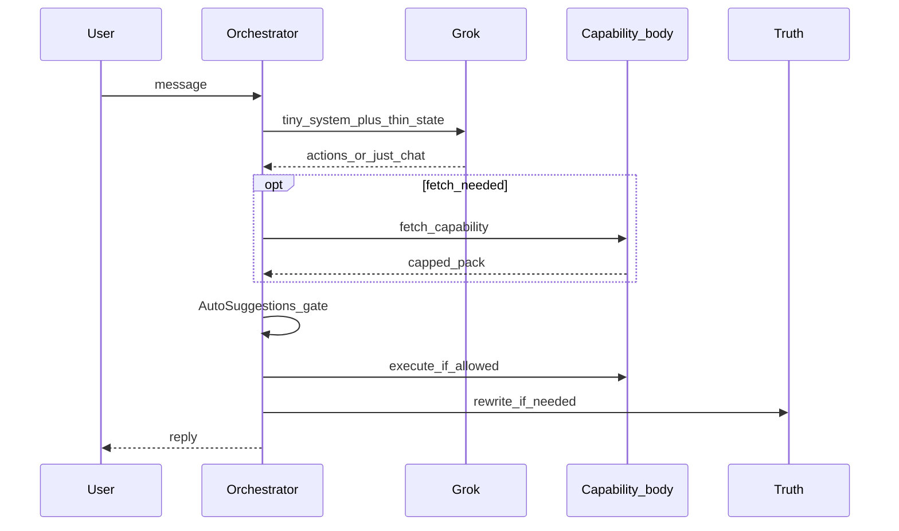

# 05 — Simple brain implementation

**Status:** Phase B complete (2026-07-18) on `plan/04-aggressive-deletion`. Phase A done.  
**Depends on:** [`04_aggressive_deletion.md`](04_aggressive_deletion.md) (complete)  
**Vision reference:** [`01_vision_gap_and_token_budget.md`](01_vision_gap_and_token_budget.md)

## 1. Goal

Rebuild a **working** assistant as:

```text
Chat/Voice → Orchestrator
  → tiny system (Truth + Off/Text/Card + capability NAMES)
  → thin state (recent turns + open thread titles if any)
  → Grok thinks → structured action(s) | just_chat | unsupported
  → fetch capability if needed
  → Auto Suggestions gate → body execute → Truth → reply
```

Grok = **LLM brain** only. **Google TTS** = spoken output. Backend = body.  
**Base** input aims **&lt; ~1k**; tools/fetch may add tokens when the situation needs them.

### Target sequence (diagram — enough “UML”)



### Platform notes (need vs nice)

| Topic | In plan 05 |
|-------|------------|
| Token budget / fetch | **Need** — base &lt;~1k; fetch may exceed |
| Remove reply length | **Need** — natural Grok answers |
| CI green again | **Need** — Phase I |
| Deploy to `/opt/clarity/current` | **Need** for device truth |
| Env awareness | **Need (light)** — prod profile settings; no env wiping Off |
| Auto CD / staging / UML tooling / VPS resize | Nice — after brain works |

## 2. New modules to create (illustrative names)

Keep files under size limits (PROJECT_STRUCTURE).

| Module | Responsibility |
|--------|----------------|
| `capability_catalog.py` | Frozen list of capability **names** + unsupported examples (tiny) |
| `brain_action_schema.py` | Structured action types Grok may return |
| `grok_turn_brain.py` (or rewire `simple_rex_brain.py`) | Build tiny messages; call Grok; parse actions |
| `capability_dispatcher.py` | Route actions → handlers |
| `capabilities/*.py` | Thin handlers wrapping durable write / finance / recall / fetch |
| `auto_suggestions_gate.py` | Off/Text/Card + kind toggles **after** actions |
| Orchestrator rewire | Only: thin context → brain → dispatch → truth → save |

Do **not** recreate `rex_intent_router` or open-thread eligibility.

## 3. Structured actions (minimum)

Grok returns JSON (or tool calls) such as:

- `just_chat` — reply text only (or model reply with no mutate)
- `unsupported` — `{ capability_hint }` → honest refusal / draft help
- `create_open_thread` / `update_open_thread` — `{ title, summary, thread_id? }`
- `create_goal` / `update_goal` / …
- `create_milestone` / `update_milestone` / `delete_milestone`
- `save_memory` / `update_memory` / `save_person` / `update_person_state` / `add_person_note`
- `save_connection` / `save_shared_history` / `save_social_group` — when Knows UI + body exist
- `delete_knows_item` / delete goal/thread/milestone variants
- `fetch_spend_insight` / `fetch_account_summary` / `categorize_transaction` / category & budget CRUD
- `search_chats` / `fetch_person_context` / `list_knows_summary`

Unknown action → treat as `unsupported` / `just_chat`. Never invent email send.

## 4. Auto Suggestions gate (after meaning)

| Mode | Behavior |
|------|----------|
| **Off** | No auto propose/ask; still `just_chat` + fetch answers; **explicit** user commands may still propose/apply with honesty |
| **Text** | Auto mutate intents → chat ask / say-yes apply; no cards |
| **Card** | Same intents → `write_proposals` / clarity confirm cards |

Kind toggles (`threads` / `goals` / `memory`) gate auto offers only.  
**No reply-length mode** — do not reintroduce concise/balanced/detailed.

## 5. Fetch pattern (token budget)

1. First Grok call with tiny system + thin state may emit `fetch_*` / `search_chats`.
2. Body runs fetch; returns a **capped** pack.
3. Optional second Grok call **or** deterministic format for numbers — stay within budget; prefer one round trip when possible.
4. Never attach full finance or full Knows on every turn “just in case.”

## 6. Body wiring (reuse)

| Action family | Executor |
|---------------|----------|
| Knows / goals / threads / delete | `DurableWriteService` propose/apply |
| Finance mutate | Clarity actions / `ClarityControlService` |
| Finance read | New thin query services over existing finance read model / mobile-provided data as designed |
| Chat search | `ChatRecallService` / conversation search |
| Person context | Entity + events (+ relationships when built) |

Confirm cards and Truth remain mandatory for durable writes.

## 7. Person state + social (Truth Rule)

### Phase order

1. Person card state field + `update_person_state` / `add_person_note` via confirm.
2. Knows UI for Connections + Shared history.
3. Only then: prompt injection of neighborhood from **confirmed** Knows data.
4. Flat memory discipline so person facts do not duplicate cards.

“Today with X” after many days → load `fetch_person_context` (state + last N notes), not full chat dump; use `search_chats` if needed.

## 8. Implementation phases + manual tests

### Phase A — Skeleton pipeline

- [x] Thin orchestrator: load settings + recent messages + thread titles
- [x] Tiny system prompt (Truth + Off/Text/Card + capability names) — no persona essay, **no reply-length block**
- [x] Grok `just_chat` round-trip saves assistant message
- [x] Truth still runs
- [x] Strip `response_style` from prompt path / profile settings UI (or ignore field)

**Manual tests:**

- [ ] Chat: “hey” → natural Grok reply (length not forced short)
- [ ] Voice path: same brain → **Google TTS** plays reply
- [ ] Base prompt size sanity: rough estimate under ~1k for empty-ish thread *(unit estimate in `test_tiny_system_prompt.py`)*

### Phase B — Unsupported + gate plumbing

- [x] `unsupported` → cannot send email; offer draft in reply
- [x] Auto Suggestions Off does not emit write proposals for soft intents
- [x] Companion settings: reply length control gone (or hidden/removed)

**Manual tests:**

- [ ] “Send an email to example@gmail.com” → no send claim; helpful draft offer
- [ ] Off + “I want to wake at 6am” with existing 3am thread → talk OK, no auto card/ask, no fake “I updated”
- [ ] Long thoughtful question → Grok may answer at natural length (not clipped by “concise”)

### Phase C — Open threads via Grok actions

- [ ] `create_open_thread` / `update_open_thread` → durable write + Text/Card/Off gate
- [ ] Grok chooses update when active thread titles are in thin state (no overlap library)

**Manual tests:**

- [ ] Card: new recurring follow-up → confirm card → appears in Goals
- [ ] Text: same → ask → “yes” / “that would be awesome” → applied
- [ ] Active 3am thread + “change sleep schedule for 6am” → **update** ask/card mentioning existing thread, not silent create
- [ ] Off + explicit “update my 3am thread to 5am” → real propose/apply path

### Phase D — Memory / person basics

- [ ] `save_memory` / `save_person` / `update_person_state` / `add_person_note` via durable write
- [ ] Delete via action + confirm

**Manual tests:**

- [ ] Save a preference → Knows visible after confirm
- [ ] Person note + state update → visible on person; assistant uses state on next fetch
- [ ] No claim “saved” without confirm

### Phase E — Goals

- [ ] `create_goal` / `update_goal` / `delete_goal`
- [ ] Goals tab shows result after confirm

**Manual tests:**

- [ ] Create goal via Card/Text; Off requires explicit command
- [ ] Goals tab shows result after confirm

### Phase E2 — Milestones (basic base)

Fit: a **milestone** is a step under a **plan/goal** (not an Open Thread). Catalog actions: create/update/delete milestone; durable write already has `milestone` / `update_milestone` kinds — wire through Grok actions + confirm, minimal Goals UI if missing.

- [ ] `create_milestone` / `update_milestone` / `delete_milestone` via dispatcher → durable write
- [ ] Thin listing under parent goal in Goals (or confirm-only path if UI thin)
- [ ] No heuristic “looks like milestone” detector — Grok chooses the action

**Manual tests:**

- [ ] With an existing goal, ask to add a small step → propose/confirm milestone
- [ ] Milestone visible under that goal after confirm
- [ ] Delete/update with confirm honesty

### Phase F — Finance fetch + allowed mutates

- [ ] `fetch_spend_insight` / `fetch_account_summary`
- [ ] Categorize / categories / budgets per UI truth
- [ ] No `create_transaction` if UI cannot

**Manual tests:**

- [ ] “How much on coffee?” → fetch then number/range; no fake precision
- [ ] “Summary of account X” → fetch
- [ ] Recategorize with confirm when edits enabled
- [ ] Edits disabled → no mutate proposals

### Phase G — Recall / inventory fetch

- [ ] `search_chats` / `list_knows_summary` as actions
- [ ] Truth on empty/degraded recall

**Manual tests:**

- [ ] “Do you remember what I said about X?” → search then grounded reply or honest miss
- [ ] Inventory question → summary without dumping entire Knows every turn

### Phase H — Person-card net (Connections → Shared history → groups)

Order (Truth Rule):

1. Knows UI for Connections + Shared history  
2. Capabilities `save_connection` / `save_shared_history`  
3. Named social groups (`save_social_group`) as part of the same net  
4. Only then: neighborhood / group context in fetches/prompts from **confirmed** Knows data  

**Manual tests:**

- [ ] Confirm connection → visible in Knows → usable in later fetch
- [ ] Shared history confirm → visible
- [ ] Social group (when wired) → visible; no invented membership
- [ ] No invented links

### Phase I — Hardening + deploy + CI

- [ ] File size splits; tests for dispatcher + gate + catalog
- [ ] Remove any leftover “redesign in progress” stubs
- [ ] `.github/workflows/ci.yml` green (rex-api pytest + mobile tests + docs canon)
- [ ] Deploy API to `/opt/clarity/current` + `scripts/vps_restart_rex_api.sh` (or equivalent)
- [ ] Confirm prod Auto Suggestions still from **profile** (env override empty)
- [ ] Spot-check **base** turn prompt size still near &lt;~1k (no always-on FC)
- [ ] Device smoke matrix: Off / Text / Card × threads / memory / finance fetch / unsupported / milestone
- [ ] Reply length control absent from Profile; answers feel natural

## 9. Explicit non-goals for 05

- Rebuilding intent routers or open-thread eligibility
- Embedding-overlap interim matcher
- Expanding system prompt with persona essays
- Reintroducing reply-length (concise/balanced/detailed)
- Always-on finance/Knows on every base turn
- Building staging, auto-CD, or infra optimization as part of this plan

## 10. Definition of done

- Single pipeline; Grok on every normal turn; Google TTS for voice out
- Catalog names match body (incl. milestones); Auto Suggestions after meaning
- Reply length removed; kill-list modules stay gone
- Manual tests for Phases A–G + E2 pass; H for person-card net (groups when ready)
- CI green; prod VPS smoke done
- Canon + `plans/` remain the only process/law sources
